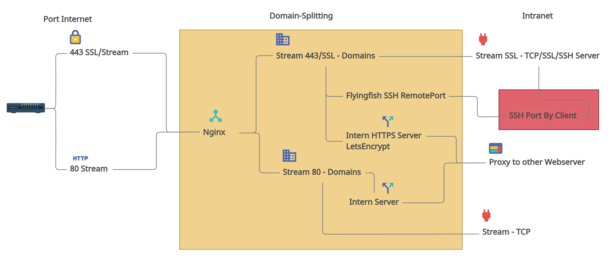
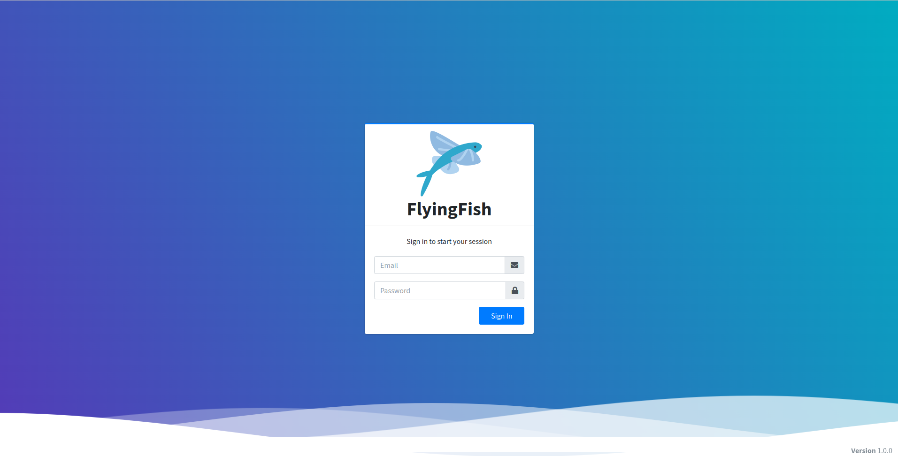

# FlyingFish

<p align="center">NOTE: This document is under development. Please check regularly for updates!</p>

<h1 align="center">


On the "Flyingfish", a ngnix proxy connection manager and more.
</h1>

[](https://github.com/stefanwerfling/flyingfish)
[](https://lgtm.com/projects/g/stefanwerfling/flyingfish/)
[](https://lgtm.com/projects/g/stefanwerfling/flyingfish/)
[](https://www.gnu.org/licenses/gpl-3.0)
[](https://liberapay.com/StefanWerf/donate)

<br>


# Index
1. [Motivation](#motivation)
   * 1.1 [Important point](#important-point)
   * 1.2 [Idea integration](#idea-integration)
   * 1.3 [Flow diagram idea](#flow-diagram-idea)
   * 1.4 [Process/development](#processdevelopment)
   * 1.5 [Projectname](#projectname)
2. [Project-Parts](#project-parts)
3. [Nginx Manager](#nginx-manager)
    * 3.1 [Docker Image](#docker-image)
    * 3.2 [Build process](#build-process)
      * 3.2.1 [Build Backend](#build-backend)
      * 3.2.2 [Build Frontend](#build-frontend)
      * 3.2.3 [Build Docker-Images](#build-docker-images)
    * 3.3 [Quick Setup](#quick-setup)
    * 3.4 [Screenshots](#screenshots)
4. [SSH-Server](#ssh-server)
    * 4.1 [Docker Image](#docker-image-1)
    * 4.2 [Connection](#connection)
5. [Contributors](#contributors)
6. [License](#license)

## Motivation
I only got to know the Nginx server after Apache. And was pleasantly surprised by the configuration. 
Some time ago I dealt with the topic of splitting several domains with destinations via the VPN via a bundled server.
I found a domain mapping/splitting in the Nginx newer version. 
From another widely used project ([Nginx proxy manager](https://nginxproxymanager.com/), which is a very good project) I use a lot the creation of certificates (Letsencrypt).
I started the project and have a lot to learn myself, to incorporate my own ideas and extensions. It is another building block for other projects that I am making available to others.

#### Important point:

1. Creation of certificates
2. Proxy web calls
3. Domain splits
4. Remote port forwarding
5. Settings via a frontend
6. API certificate query for internal web servers in the internal network
7. and more ...

#### Idea integration


* Fast installation through Docker.

<table style="border: 0px;">
<tr>
<td>

</td>
<td>

</td>
<td>

</td>
</tr>
</table>

* In addition to the classic problem of providing HTTPS connections with Letsencrypt certificates, URI with a proxy to direct to internal web servers. Was the idea to use "SSH Remote Port forwarding" to forward a local web server via SSH (via the internet or internal network) so that it can be reached via Nginx with a valid HTTPs certificate.


* I see an advantage in testing projects that require an API connection or for rolling out a user-defined configuration that can be delivered securely using HTTPs.


* Using Upnp Nat so that the ports are automatically forwarded via the router. It is also possible to carry out a Nat with several routers.


* DynDns Client for updates by IP changes.

#### Flow diagrams idea
#### Nginx


[see more](https://app.creately.com/d/HhWb5041Utr/view)


#### Process/development

Currently I will first generate simple configuration files for Nginx and feel the database by hand. A frontend will be developed step by step. I'm hoping for suggestions and other ideas. Write to me!

#### Projectname

The name of the project is an allusion to the fish that is "air" in an atypical environment for it. Nevertheless, the fish copes perfectly here. This is how I see the project with the Nginx server and the interacting components. The name also goes well with "Docker" a whale.

# Project-Parts
* Nginx Manager
* SSH-Server

# Nginx Manager
### Docker Image
* Image: Alpine

### Build process
The following steps must be carried out to create the Docker image:

Install Typescript:
```shell
sudo apt install node-typescript 
```

Install Gulp:
```shell
npm install --global gulp-cli
```

#### Build Backend
```shell
cd backend && npm install && tsc -p tsconfig.json
```

#### Build Frontend
```shell
cd frontend && npm install && tsc -p tsconfig.json
```

```shell
cd build && npm install && gulp copy-data
```

#### Build Docker-Images
```shell
cd ./ && docker-compose build
```

## Quick Setup

1. Install Docker and Docker-Compose

   - [Docker Install documentation](https://docs.docker.com/install/)
   - [Docker-Compose Install documentation](https://docs.docker.com/compose/install/)


2. Create a docker-compose.yml file similar to this:
```yml
version: '3.1'

services:
  mariadb:
    image: mariadb:latest
    container_name: flyingfish_db
    environment:
      MYSQL_ROOT_PASSWORD: 'test'
      MYSQL_ROOT_HOST: '%'
      MYSQL_DATABASE: 'flyingfish'
    volumes:
      - flyingfishDbData:/var/lib/mysql
    ports:
      - 127.0.0.1:3306:3306
    networks:
      flyingfishNet:
          ipv4_address: 10.103.0.2
    logging:
      driver: "json-file"
      options:
        max-size: "500k"
        max-file: "50"

  flyingfish:
    image: flingfish:v1.0
    build:
      context: ./
    container_name: flyingfish_service
    volumes:
      - ./config.json:/opt/app/config.json
    ports:
      - "443:443"
      - "80:80"
      - "3000:3000"
    networks:
      flyingfishNet:
        ipv4_address: 10.103.0.3
    logging:
      driver: "json-file"
      options:
        max-size: "500k"
        max-file: "50"
    depends_on:
      - mariadb

  sshremote:
    image: flyingfishssh:v1.0
    build:
      context: ./sshserver/
    container_name: flyingfish_ssh
    volumes:
      - ./config.json:/opt/app/config.json
      - ./sshserver/ssh:/opt/app/ssh:rw
    ports:
      - "2222:22"
    networks:
      flyingfishNet:
        ipv4_address: 10.103.0.4
    logging:
      driver: "json-file"
      options:
        max-size: "500k"
        max-file: "50"
    depends_on:
      - mariadb

volumes:
  flyingfishDbData:
    driver: local

networks:
  flyingfishNet:
    driver: bridge
    ipam:
      config:
        -  subnet: 10.103.0.0/16
```
Create a ```config.json``` similar to this:
```json
{
  "db": {
    "mysql": {
      "host": "10.103.0.2",
      "port": 3306,
      "username": "root",
      "password": "test",
      "database": "flyingfish"
    }
  },
  "httpserver": {
    "port": 3000,
    "publicdir": "frontend"
  },
  "nginx": {
    "config": "/opt/app/nginx/nginx.conf",
    "prefix": "/opt/app/nginx"
  },
  "sshserver": {
    "ip": "10.103.0.4"
  }
}
```

3. Bring up your stack by running

```bash
docker-compose up -d
```

4. Log in to the Admin UI by the first start is the admin user create by the backend:

    [http://127.0.0.1:3000](http://127.0.0.1:3000)
   
Default Admin User:
* EMail: ```admin@flyingfish.org```
* Password: ```changeMyPassword```

#### Screenshots
<table>
  <tr>
    <td> 
      
    </td>
  </tr>
</table>

# SSH-Server
### Docker Image
* Image: Alpine

### Connection
Create over ssh a remote port forwarding:
```shell
ssh -R 3000:localhost:3000 ffadmin@192.168.0.115 -p 2222
//ssh -R myPort:myIP:remotePort sshUser@ipSSHServer -p portSSH
```

# Contributors

Special thanks to the following contributors:

TODO

# License
[](https://www.gnu.org/licenses/gpl-3.0)

This project is licensed under the GNU General Public License v3.0. See the [LICENSE](LICENSE) file for details.