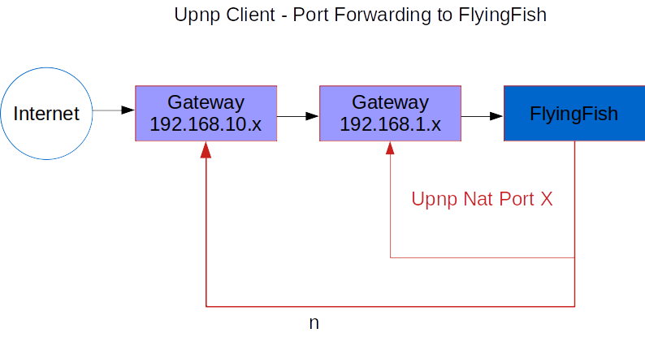

# FlyingFish

<p align="center">NOTE: This document is under development. Please check regularly for updates!</p>

<h1 align="center">


On the "Flyingfish", a nginx proxy connection manager and more.
</h1>

[](https://github.com/stefanwerfling/flyingfish)
[](https://lgtm.com/projects/g/stefanwerfling/flyingfish/)
[](https://lgtm.com/projects/g/stefanwerfling/flyingfish/)
[](https://www.gnu.org/licenses/gpl-3.0)
[](https://liberapay.com/StefanWerf/donate)

<br>


<br>

[](https://bestpractices.coreinfrastructure.org/projects/6347)
[](https://coveralls.io/github/stefanwerfling/flyingfish?branch=main)

# Index
1. [Motivation](#motivation)
   * 1.1 [Important point](#important-point)
   * 1.2 [Idea integration](#idea-integration)
   * 1.3 [Flow diagram idea](#flow-diagram-idea)
   * 1.4 [Process/development](#processdevelopment)
   * 1.5 [Projectname](#projectname)
   * 1.6 [Extentions](#extentions)
     * 1.6.1 [Flyingfish-Shield](#flyingfish-shield)
     * 1.6.2 Flyingfish-Onion-Hat (TODO)
     * 1.6.3 Flyingfish-VPN-River (TODO)
     * 1.6.4 Flyingfish-Horde (TODO)
2. [Project-Parts](#project-parts)
3. [Nginx Manager](#nginx-manager)
    * 3.1 [Docker Image](#docker-image)
    * 3.2 [Build process](#build-process)
      * 3.2.1 [Build Backend](#build-backend)
      * 3.2.2 [Build Frontend](#build-frontend)
      * 3.2.3 [Build Docker-Images](#build-docker-images)
    * 3.3 [Quick Setup](#quick-setup)
    * 3.4 [Screenshots](#screenshots)
4. [SSH-Server](#ssh-server)
    * 4.1 [Docker Image](#docker-image-1)
    * 4.2 [Connection](#connection)
5. [How Debug](#how-debug)
6. [Todo](#todo)
7. [Contributors](#contributors)
8. [License](#license)
9. [Faq](#faq)

## Motivation
I only got to know the Nginx server after Apache. And was pleasantly surprised by the configuration. 
Some time ago I dealt with the topic of splitting several domains with destinations via the VPN via a bundled server.
I found a domain mapping/splitting in the Nginx newer version. 
From another widely used project ([Nginx proxy manager](https://nginxproxymanager.com/), which is a very good project) I use a lot the creation of certificates (Letsencrypt).
I started the project and have a lot to learn myself, to incorporate my own ideas and extensions. It is another building block for other projects that I am making available to others.

#### Important point:

1. Creation of certificates
2. Proxy web calls
3. Domain splits
4. Remote port forwarding
5. Settings via a frontend
6. API certificate query for internal web servers in the internal network
7. and more ...

#### Idea integration
<table style="border: 0px;">
<tr>
<td>

</td>
</tr>
</table>

* Fast installation through Docker.

<table style="border: 0px;">
<tr>
<td>

</td>
<td>

</td>
<td>

</td>
</tr>
</table>

* In addition to the classic problem of providing HTTPS connections with Letsencrypt certificates, URI with a proxy to direct to internal web servers. Was the idea to use "SSH Remote Port forwarding" to forward a local web server via SSH (via the internet or internal network) so that it can be reached via Nginx with a valid HTTPs certificate.

<table style="border: 0px;">
<tr>
<td>

</td>
</tr>
</table>

* I see an advantage in testing projects that require an API connection or for rolling out a user-defined configuration that can be delivered securely using HTTPs.

<table style="border: 0px;">
<tr>
<td>

</td>
</tr>
</table>

* Using Upnp Nat so that the ports are automatically forwarded via the router. It is also possible to carry out a Nat with several routers.

<table style="border: 0px;">
<tr>
<td>

</td>
</tr>
</table>

* DynDns Client for updates by IP changes.
* DynLocation Client, a small program that uses an API key that gives FlyingFish the information where the server is in the network (with DHCP IP) and thus adjusts the location of Nginx, much like DynDNS.
  Helpful for developers.

#### Flow diagrams idea
#### Nginx & Express Action


#### Nginx & Express Streams


#### Upnp Client Nat


#### Process/development

Currently I will first generate simple configuration files for Nginx and feel the database by hand. A frontend will be developed step by step. I'm hoping for suggestions and other ideas. Write to me!

#### Projectname

The name of the project is an allusion to the fish that is "air" in an atypical environment for it. Nevertheless, the fish copes perfectly here. This is how I see the project with the Nginx server and the interacting components. The name also goes well with "Docker" a whale.

#### Extentions
As mentioned above "7. and more" I will include many extensions in the project, these can be used, but do not have to. I think that brings added value to the project in the form of more use cases.

##### Flyingfish-Shield
The shield is supposed to provide protection for the Nginx, or the application behind the Nginx. As shown above, the NJS module is implemented in Nginx. The IPs are checked via the Nginx stream. During my development with the module and the Upnp Nat, I noticed in the logs that constant IPs around the world were querying my unknown (and briefly living) server.
My research has shown that the IPs are already known and that IPs are from Internet scanners from all nations to uncover the network.

My idea for this is to take information from databases and projects that are already known and to block these IPs. In addition, I thought of adding a "knock" function. The "knock" triggers a ritual and then the IP is safely let through again. Maybe you can also join forces with other projects. I'll expand on this idea further later.

# Project-Parts
* Nginx Manager
* SSH-Server
* Onion/Tor-Service
* DynLocation (TODO)

# Nginx Manager
### Docker Image
* Image: Alpine

### Build process
The following steps must be carried out to create the Docker image:

Install Typescript:
```shell
sudo apt install node-typescript 
```

Install Gulp:
```shell
npm install --global gulp-cli
```

#### Build Backend
```shell
cd backend && npm install && tsc -p tsconfig.json
```

#### Build Frontend
```shell
cd frontend && npm install && tsc -p tsconfig.json
```

```shell
cd build && npm install && gulp copy-data
```

#### Build Docker-Images
```shell
cd ./ && docker-compose build
```

## Quick Setup

1. Install Docker and Docker-Compose

   - [Docker Install documentation](https://docs.docker.com/install/)
   - [Docker-Compose Install documentation](https://docs.docker.com/compose/install/)


2. Create a docker-compose.yml file similar to this:
```yml
version: '3.1'

services:
  mariadb:
    image: mariadb:latest
    container_name: flyingfish_db
    environment:
      MYSQL_ROOT_PASSWORD: 'test'
      MYSQL_ROOT_HOST: '%'
      MYSQL_DATABASE: 'flyingfish'
    volumes:
      - flyingfishDbData:/var/lib/mysql
    ports:
      - 127.0.0.1:3306:3306
    networks:
      flyingfishNet:
          ipv4_address: 10.103.0.2
    logging:
      driver: "json-file"
      options:
        max-size: "500k"
        max-file: "50"

  flyingfish:
    image: flingfish:v1.0
    build:
      context: ./
    container_name: flyingfish_service
    volumes:
      - ./config.json:/opt/app/config.json
    ports:
      - "443:443"
      - "80:80"
      - "5333:53/udp"
      - "5333:53/tcp"
      - "3000:3000"
      - "1900:1900"
    networks:
      flyingfishNet:
        ipv4_address: 10.103.0.3
    logging:
      driver: "json-file"
      options:
        max-size: "500k"
        max-file: "50"
    depends_on:
      - mariadb

  sshremote:
    image: flyingfishssh:v1.0
    build:
      context: ./sshserver/
    container_name: flyingfish_ssh
    volumes:
      - ./config.json:/opt/app/config.json
      - ./sshserver/ssh:/opt/app/ssh:rw
    ports:
      - "2222:22"
    networks:
      flyingfishNet:
        ipv4_address: 10.103.0.4
    logging:
      driver: "json-file"
      options:
        max-size: "500k"
        max-file: "50"
    depends_on:
      - mariadb

volumes:
  flyingfishDbData:
    driver: local

networks:
  flyingfishNet:
    driver: bridge
    ipam:
      config:
        -  subnet: 10.103.0.0/16
```
Create a ```config.json``` similar to this:
```json
{
  "db": {
    "mysql": {
      "host": "10.103.0.2",
      "port": 3306,
      "username": "root",
      "password": "test",
      "database": "flyingfish"
    }
  },
  "httpserver": {
    "port": 3000,
    "publicdir": "frontend"
  },
  "nginx": {
    "config": "/opt/app/nginx/nginx.conf",
    "prefix": "/opt/app/nginx"
  },
  "sshserver": {
    "ip": "10.103.0.4"
  }
}
```

3. Bring up your stack by running

```bash
docker-compose up -d
```

4. Log in to the Admin UI by the first start is the admin user create by the backend:

    [https://127.0.0.1:3000](https://127.0.0.1:3000)
   
Default Admin User:
* EMail: ```admin@flyingfish.org```
* Password: ```changeMyPassword```

5. Test your DNS-Flyingfish Server
```shell
dig @127.0.0.1 -p5333 <mydomain>
```

#### Screenshots
<table>
    <tr>
        <td> 
            
        </td>
        <td>
            
        </td>
    </tr>
    <tr>
        <td>
            
        </td>
        <td>
            &nbsp;
        </td>
    </tr>
</table>

# SSH-Server
### Docker Image
* Image: Alpine

### Connection
Create over ssh a remote port forwarding:
```shell
ssh -R 3000:localhost:3000 ffadmin@192.168.0.115 -p 2222
//ssh -R myPort:myIP:remotePort sshUser@ipSSHServer -p portSSH
```

# How Debug
Edit the docker-compose file and add the Port for the NodeJs Debuger ```9229```, 
then override the NodeJS ```command``` start with ```--inspect-brk```. 

The docker container will wait for Debug connection. 
* Remove it again for the production environment!

example:

```yaml
flyingfish:
    image: flyingfish:v1.0
    build:
      context: ./
    container_name: flyingfish_service
    volumes:
      - ./config.json:/opt/app/config.json
      - ./nginx:/opt/app/nginx:rw
      - ./letsencrypt:/etc/letsencrypt:rw
    ports:
      - "443:443"
      - "80:80"
      - "3000:3000"
      - "1900:1900"
      - "9229:9229"
    command:
      - node
      - "--inspect-brk=0.0.0.0:9229"
      - "dist/main.js"
      - "--config=/opt/app/config.json"
    networks:
      flyingfishNet:
        ipv4_address: 10.103.0.3
    logging:
      driver: "json-file"
      options:
        max-size: "500k"
        max-file: "50"
    depends_on:
      - mariadb
```

# Todo
My Todo list:
* [ ] credential cache, for more speed up? (reduce nginx <--> express request time)
* [ ] ip blacklist cache, for more speed up? (reduce nginx <--> express request time)
* [ ] add nginx auth with digest
* [ ] nginx monitoring (traffic, connections and more)?
* [ ] add credential ldap client
* [ ] ip blacklist downloader & importer https://github.com/firehol/blocklist-ipsets

# Contributors

Special thanks to the following contributors:

<!-- prettier-ignore-start -->
<!-- markdownlint-disable -->
<table>
	<tr>
		<td align="center">
			<a href="https://github.com/Choppel">
				
				<br /><sub><b>Choppel</b></sub>
			</a>
		</td>
	</tr>
</table>
<!-- markdownlint-enable -->
<!-- prettier-ignore-end -->

# License
[](https://www.gnu.org/licenses/gpl-3.0)

This project is licensed under the GNU General Public License v3.0. See the [LICENSE](LICENSE) file for details.

# FAQ

### how to check supported nginx modules in docker image?
First you start your docker container. Then go inside:
```shell
docker exec -it flyingfish_service /bin/ash
```

Now you can check the modules with:
```shell
nginx -V
```
the result is:
```shell
nginx version: nginx/1.20.2
built by gcc 10.3.1 20211027 (Alpine 10.3.1_git20211027) 
built with OpenSSL 1.1.1l  24 Aug 2021
TLS SNI support enabled
configure arguments: --prefix=/etc/nginx --sbin-path=/usr/sbin/nginx --modules-path=/usr/lib/nginx/modules --conf-path=/etc/nginx/nginx.conf --error-log-path=/var/log/nginx/error.log --http-log-path=/var/log/nginx/access.log --pid-path=/var/run/nginx.pid --lock-path=/var/run/nginx.lock --http-client-body-temp-path=/var/cache/nginx/client_temp --http-proxy-temp-path=/var/cache/nginx/proxy_temp --http-fastcgi-temp-path=/var/cache/nginx/fastcgi_temp --http-uwsgi-temp-path=/var/cache/nginx/uwsgi_temp --http-scgi-temp-path=/var/cache/nginx/scgi_temp --with-perl_modules_path=/usr/lib/perl5/vendor_perl --user=nginx --group=nginx --with-compat --with-file-aio --with-threads --with-http_addition_module --with-http_auth_request_module --with-http_dav_module --with-http_flv_module --with-http_gunzip_module --with-http_gzip_static_module --with-http_mp4_module --with-http_random_index_module --with-http_realip_module --with-http_secure_link_module --with-http_slice_module --with-http_ssl_module --with-http_stub_status_module --with-http_sub_module --with-http_v2_module --with-mail --with-mail_ssl_module --with-stream --with-stream_realip_module --with-stream_ssl_module --with-stream_ssl_preread_module --with-cc-opt='-Os -fomit-frame-pointer -g' --with-ld-opt=-Wl,--as-needed,-O1,--sort-common
```

### MariaDB Error 
```
[ERROR] Incorrect definition of table mysql.column_stats: expected column 'histogram' at position 10 to have type longblob, found type varbinary(255)
```
Repair/Update DB:
```shell
docker exec flyingfish_db mysql_upgrade --user=root --password=<password>
```