

 

  

 

# Flyingfish

Flyingfish is a reverse proxy manager with its own DNS server, own SSH server, DynDNS, UPNP support, LetsEncrypt and much more.
With a frontend, it simplifies setup and management. Each route can be edited with extensive settings.

## Features

- **Reverse Proxy** - Nginx has a list table in which ports to be listened to can be entered. A direct stream (TCP/UDP) route on an intranet server can be set under "Routes".

	If the protocol is an SSL protocol, it can be recognized by the domain and transmitted over the standard port 443 on an intranet server. So port 443 is normally bundled for all HTTPS servers. All other servers that also support SSL can also be dragged over port 443. The internal SSH server reacts on port 443 as the default route if no SSL and domain were recognized.

- **HTTPS certificate** - The FlyingFish can help you get, manage and update a valid LetsEntcrypt certificate for a domain automatically.

	After the certificate is issued, the internal Nginx server is automatically restarted and the route to the internal server is loaded on the intranet without failure (connection interruption of existing connections on the other domains).

- **DNS Server** - Administration of domains and sub-domains, in the standard case, you log in to your provider (in my example Selfhost) and manage all domains and subdomains there. Let's assume 'example.de' and 'sub.example.de'.

	This concept may be okay, but it's a work in progress with lots of subdomains coming up. Each service to the outside can have its own subdomain. To name a few examples "Jitsi", "OnlyOffice", "EGroupware", "FindNow" etc. So whenever a service is on the main URL path and a subpath becomes too complicated, we go into administration with "subdomains" to avoid the problem. It's also a clean solution for managing to keep track of things. Additional "subdomains" are also required for e-mail servers, such as "imap.example.de" or "smtp.example.de".

	In order to minimize the effort, the FlyingFish can now manage the domains itself. By responding as a domain server. For this purpose, a "main domain" e.g.: 'example.de' is only set with an "NS" record. This "NS" record points to "Nameserver" i.e. another domain, e.g. 'example-dyn.de' with "A" record. The "A" record is always set by a DynDNS account with the correct IP that is publicly accessible.

	The FlyingFish sets the correct public IP via DynDNS and responds as a DNS server to all domains and subdomains of 'example.de'. These domains from the FlyingFish DNS server can be set either with a fixed IP or with the public IP that is automatically updated. The DNS server always delivers the correct IPs on the domains. The existing domains can now be selected as a route in Nginx.

	All requests to the DNS server are streamed via Nginx beforehand. The connections to the DNS server are thus subject to black and white listing for IP access.

- **IP access (blacklist and whitelist)** - The Internet and a public IP are always under observation and access. Permanent scans from all over the world run over the IP. The blacklist and whitelist were introduced in order to partially avoid these and to build in security.

	All port requests (HTTP, HTTPS, DNS) first go through Nginx as a stream. A check for the IP with a blacklist or whitelist can be set for each stream.

	The whitelist allows access to the port only for the stored IPs.

	The blacklist is divided into two parts. Own added IPs that no longer get access, or the imported list. The imported list is a list of all known attackers and scanners from around the world.

	Both methods increase protection.

- **Internal SSH server port forwarding** - The Internal SSH Server is just a port forwarding server. No shell commands can be executed!

	There are two types of port forwarding, a port forwarding from the intranet to the client, or a forwarding from the client to the internal SSH server. This internal port can be used as a route for HTTP/HTTPS.

	The internal SSH server is hidden/bundled on port 443. An authentication is specified separately for each route and is at the same time the separation of different routes/ports.

- **Upnp nat client** - This client can take care of automatically releasing the ports for listening from Nginx on the route (gateway). If the computer on which FlyingFish is installed is mobile or the gateways change, the client can always send them to the right router and open the ports to the FlyingFish.

	This means that the FlyingFish can always be reached correctly with the DynDns client from outside (Internet).

## Docker Hub

I utilise the docker manifest for multi-platform awareness. Simply getting "stefanwerfling/flyingfish:latest" should get the correct image for your arch. However, you can also get specific Arch images via tags.

The architectures supported by this image are:

| Architecture | Available | Tag |
| :----: | :----: | ---- |
| x86-64 | ✅ | amd64-\<version tag\> |
| arm64 | ✅ | arm64v8-\<version tag\> |

Other platforms cannot be created as an image, because the restriction comes from the node docker image, but also because "certbot with pip" only supports amd64 and arm64 installation.

But it's better you run the installation with the instructions in Docker-Compose. Because FlyingFish consists of multiple images & containers.

[FlyingFish on hub.docker.com](https://hub.docker.com/r/stefanwerfling/flyingfish)

### Docker images (latest)
* stefanwerfling/flyingfish:latest
* stefanwerfling/flyingfish:v1.0.17
* stefanwerfling/flyingfish_ssh:latest
* stefanwerfling/flyingfish_ssh:v1.0.17
* stefanwerfling/flyingfish_himip:latest
* stefanwerfling/flyingfish_himip:v1.0.17

# Index
1. [Project Description](doc/description.md)
2. [First installation](doc/firstinstall.md)
3. [For devs](doc/dev.md)
4. [FAQ](doc/faq.md)

#### Screenshots
<table>
    <tr>
        <td> 
            
        </td>
        <td>
			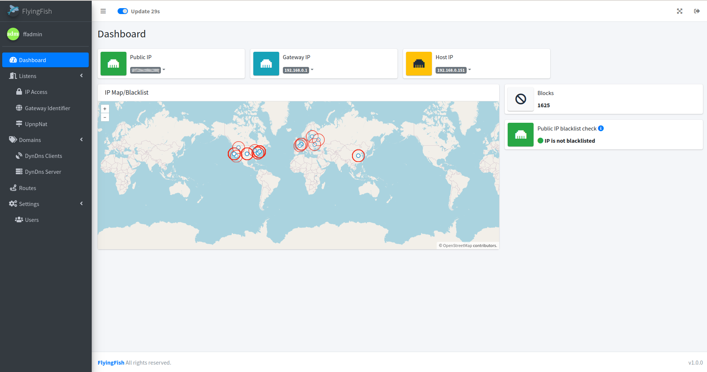&nbsp;
        </td>
    </tr>
    <tr>
        <td>
			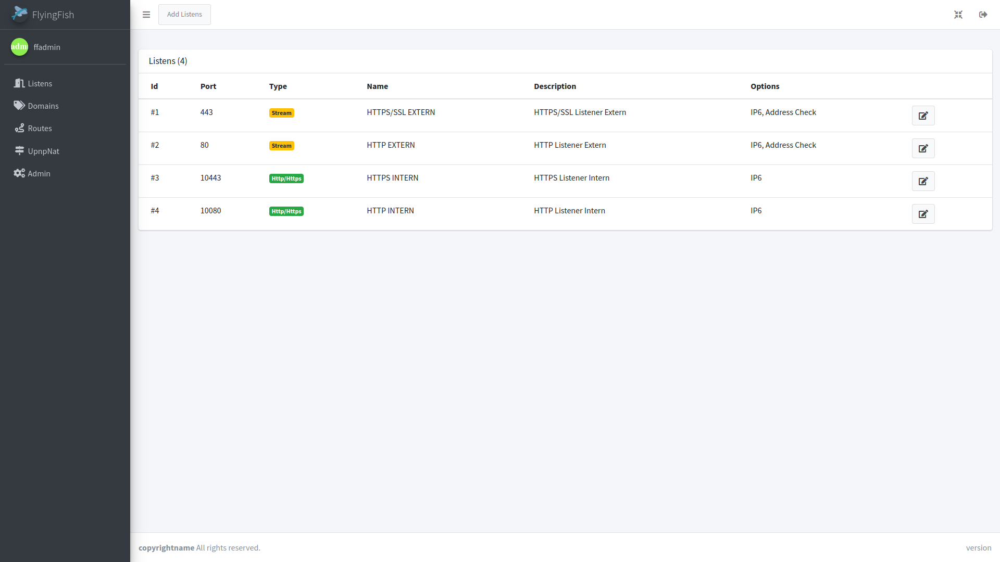
        </td>
        <td>
            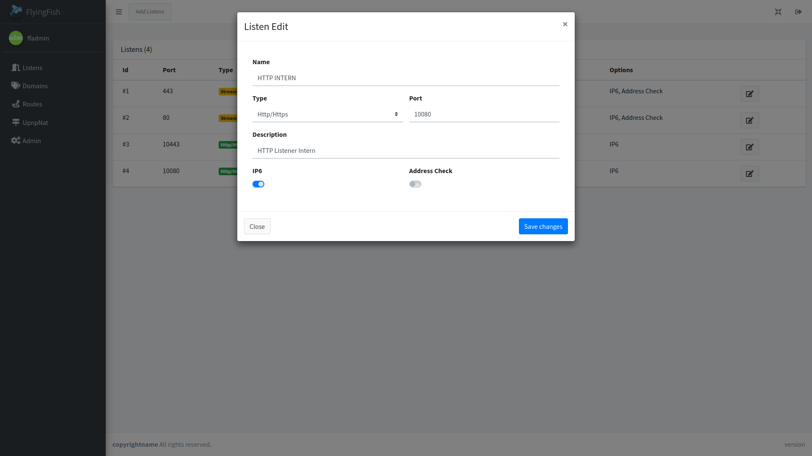
        </td>
    </tr>
	<tr>
		<td>
			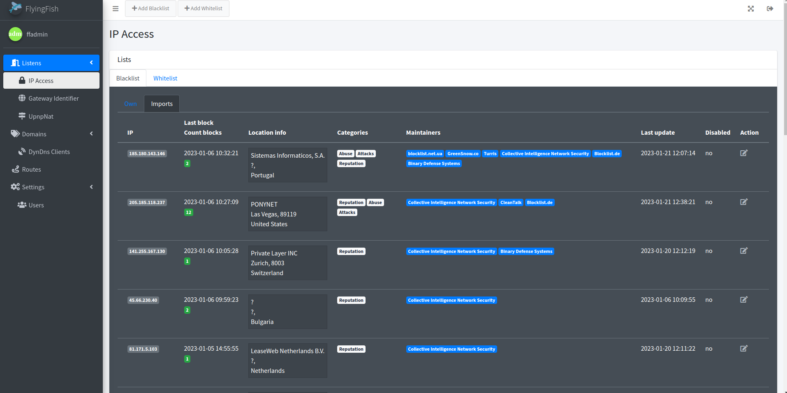
		</td>
		<td>
			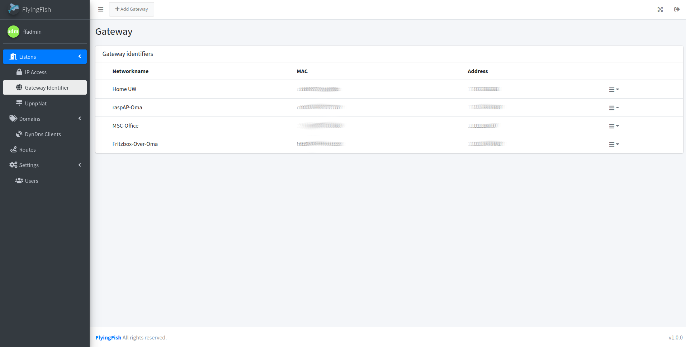
		</td>
	</tr>
	<tr>
		<td>
			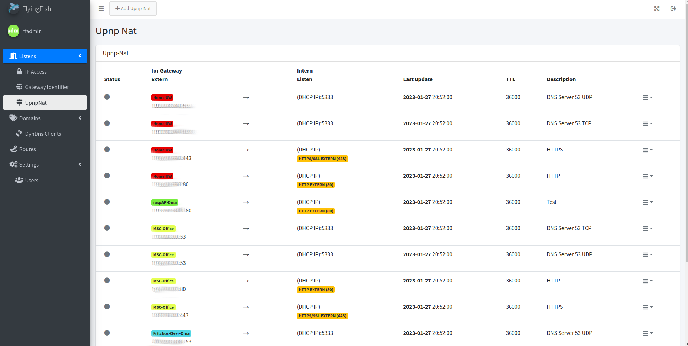
		</td>
		<td>
			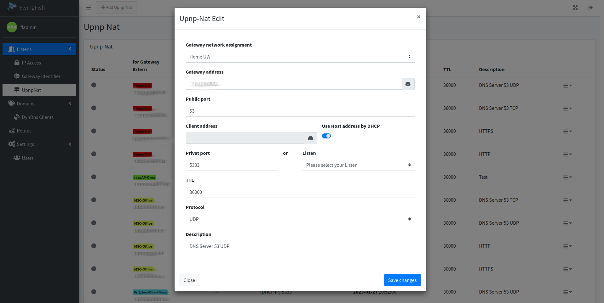
		</td>
	</tr>
	<tr>
		<td>
			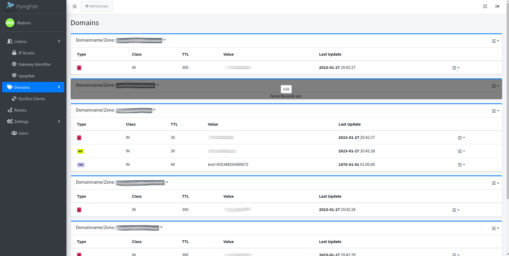
		</td>
		<td>
			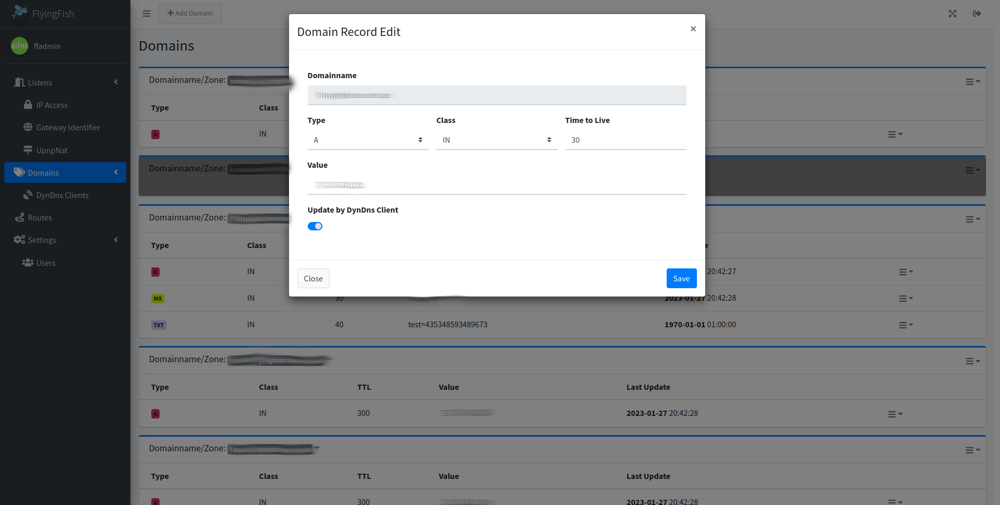
		</td>
	</tr>
	<tr>
		<td>
			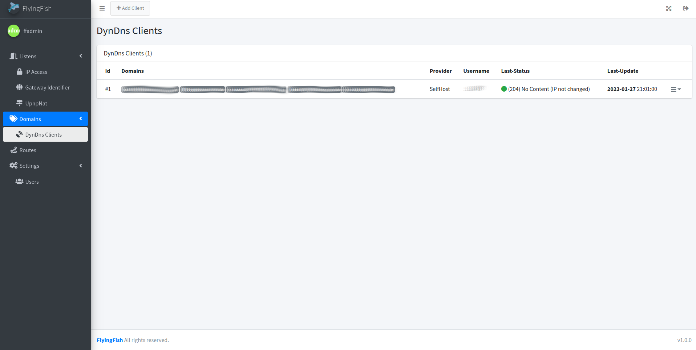
		</td>
		<td>
			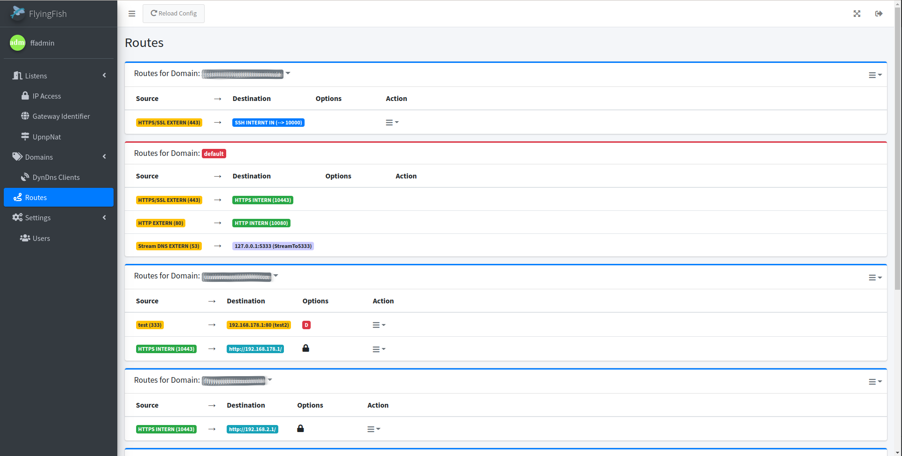
		</td>
	</tr>
	<tr>
		<td>
			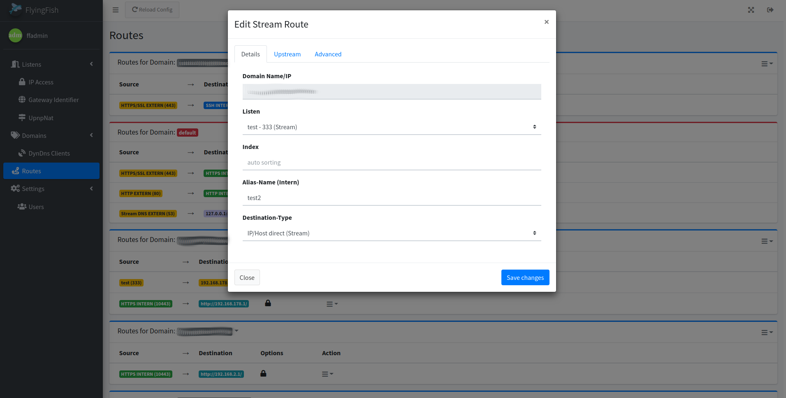
		</td>
		<td>
			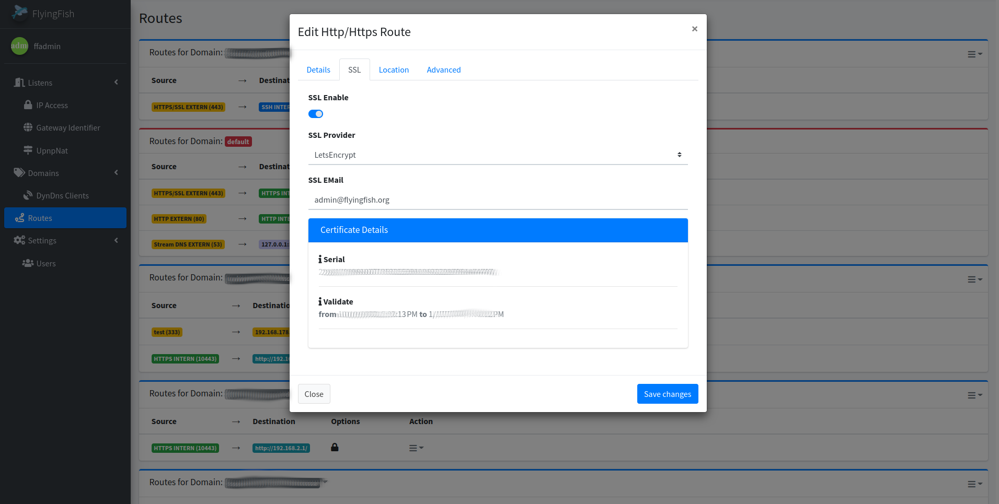
		</td>
	</tr>
</table>

# Contributors

Special thanks to the following contributors:

<!-- prettier-ignore-start -->
<!-- markdownlint-disable -->
<table>
	<tr>
		<td align="center">
			<a href="https://github.com/Choppel">
				
				 <b>Choppel</b>
			</a>
		</td>
	</tr>
</table>
<!-- markdownlint-enable -->
<!-- prettier-ignore-end -->

# License

This project is licensed under the GNU General Public License v3.0. See the [LICENSE](LICENSE) file for details.
