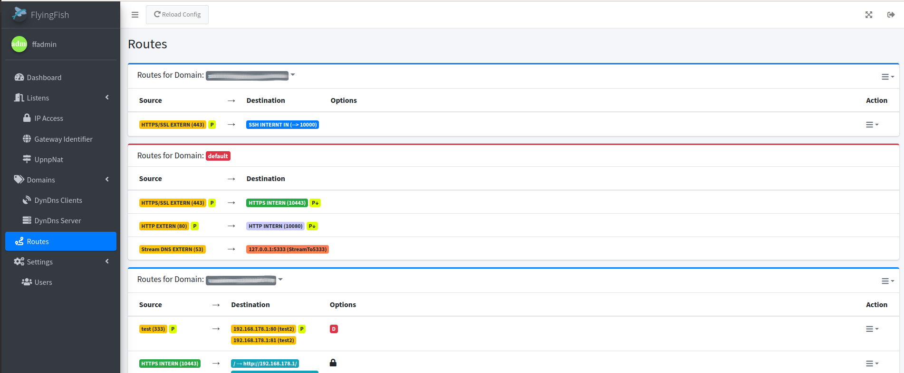

# Flyingfish

  

 

 

 

FlyingFish is a reverse proxy manager with own WebUI, DNS server, SSH server, DynDNS, UPNP support, Lets Encrypt and much more.

## Make your services available easily, quickly and securely.

In the classic sense, FlyingFish is a nginx manager. But the way the nginx server is combined with other services is different! The FlyingFish is structured in part service, which automates many processes through an internal database or API communication.

[Read the Documentation](https://flying-fish.gitbook.io/)

## Quick setup
[Read the Documentation quick setup](https://flying-fish.gitbook.io/flyingfish/index/installation#quick-setup)

## Release

- [Version 1.1.0](https://github.com/stefanwerfling/flyingfish/milestone/1)

## Current work
With the milestone version [1.1.0](https://github.com/stefanwerfling/flyingfish/milestone/1) and now [1.2.0](https://github.com/stefanwerfling/flyingfish/milestone/2) the abstraction and division will now be revised. The implementation of plugins and new functions now requires a review of the existing code. This involves a lot of changes to code management and the package.

## In progress

- [Version 1.2.0](https://github.com/stefanwerfling/flyingfish/milestone/2)
- [Version 1.3.0](https://github.com/stefanwerfling/flyingfish/milestone/3)
- [Version 1.4.0](https://github.com/stefanwerfling/flyingfish/milestone/4)

## Docker Hub

I utilize the docker manifest for multi-platform awareness.
Simply getting "stefanwerfling/flyingfish:latest" should get the correct image for your arch.
However, you can also get specific Arch images via tags.

The architectures supported by this image are:

| Architecture | Available | Tag |
| :----: | :----: | ---- |
| x86-64 | ✅ | amd64-\<version tag\> |
| arm64 | ✅ | arm64v8-\<version tag\> |

Other platforms cannot be created as an image, because the restriction comes from the node docker image, but also because "certbot with pip" only supports amd64 and arm64 installation.

But it's better you run the installation with the instructions in Docker-Compose. Because FlyingFish consists of multiple images & containers.

[FlyingFish on hub.docker.com](https://hub.docker.com/r/stefanwerfling/flyingfish)

### Docker images (latest)
* stefanwerfling/flyingfish:latest
* stefanwerfling/flyingfish:v1.1.12
* stefanwerfling/flyingfish_ssh:latest
* stefanwerfling/flyingfish_ssh:v1.1.12
* stefanwerfling/flyingfish_himip:latest
* stefanwerfling/flyingfish_himip:v1.1.12
* stefanwerfling/flyingfish_ddns:latest
* stefanwerfling/flyingfish_ddns:v1.1.12

#### Screenshots
<table>
    <tr>
        <td> 
            
        </td>
        <td>
			&nbsp;
        </td>
    </tr>
    <tr>
        <td>
			
        </td>
        <td>
            
        </td>
    </tr>
	<tr>
		<td>
			
		</td>
		<td>
			
		</td>
	</tr>
	<tr>
		<td>
			
		</td>
		<td>
			
		</td>
	</tr>
	<tr>
		<td>
			
		</td>
		<td>
			
		</td>
	</tr>
	<tr>
		<td>
			
		</td>
		<td>
			
		</td>
	</tr>
	<tr>
		<td>
			
		</td>
		<td>
			
		</td>
	</tr>
</table>

# Supported by
Special thanks to the following companys:
<!-- prettier-ignore-start -->
<!-- markdownlint-disable -->
<table>
	<tr>
		<td align="center">
            <a href="https://jb.gg/OpenSourceSupport">
				
				 <b>JetBrains</b>
			</a>
        </td>
	</tr>
</table>

# Contributors

Special thanks to the following contributors:

<!-- prettier-ignore-start -->
<!-- markdownlint-disable -->
<table>
	<tr>
		<td align="center">
			<a href="https://github.com/Choppel">
				
				 <b>Choppel</b>
			</a>
		</td>
	</tr>
</table>
<!-- markdownlint-enable -->
<!-- prettier-ignore-end -->

# License

This project is licensed under the GNU General Public License v3.0. See the [LICENSE](LICENSE) file for details.

