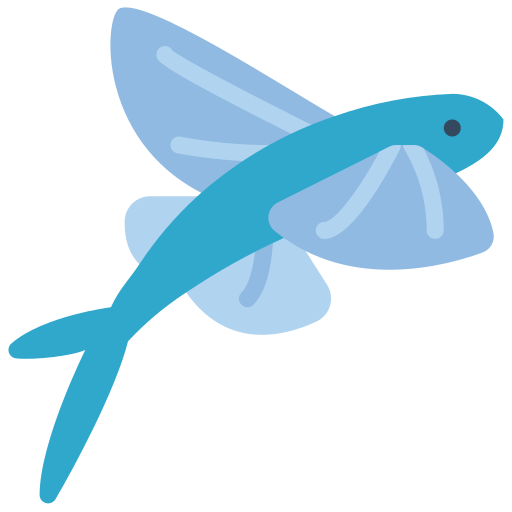

# FlyingFish

<figure><figcaption></figcaption></figure>

## Make your services available easily, quickly and securely

<table data-view="cards"><thead><tr><th></th><th></th><th></th><th data-hidden data-card-cover data-type="files"></th></tr></thead><tbody><tr><td><strong>Web UI</strong></td><td>Simple and everywhere callable interface in the browser</td><td></td><td><a href=".gitbook/assets/21bf36ff-6927-4ecc-ae64-27f363d3e665.jpeg">21bf36ff-6927-4ecc-ae64-27f363d3e665.jpeg</a></td></tr><tr><td><strong>Proxy Server</strong></td><td>Managing the traffic of services from the Internet</td><td></td><td><a href=".gitbook/assets/38601d6a-cee3-42ff-a626-c5126760bc63.jpeg">38601d6a-cee3-42ff-a626-c5126760bc63.jpeg</a></td></tr><tr><td><strong>Secure</strong></td><td>Secure connections with SSL</td><td></td><td><a href=".gitbook/assets/67f727af-ff1a-4820-9100-c273abeff281.jpeg">67f727af-ff1a-4820-9100-c273abeff281.jpeg</a></td></tr><tr><td><strong>IP access control</strong> </td><td>Check blacklist/whitelist of accessing IPs</td><td></td><td><a href=".gitbook/assets/5037af6f-2595-4b1d-ad02-d90207d06e91.jpeg">5037af6f-2595-4b1d-ad02-d90207d06e91.jpeg</a></td></tr><tr><td><strong>Domain management</strong></td><td>Manage domains, subdomains and record entries</td><td></td><td><a href=".gitbook/assets/6a3608b6-0ddc-4e46-b476-c8cbc4400b94.jpeg">6a3608b6-0ddc-4e46-b476-c8cbc4400b94.jpeg</a></td></tr><tr><td><strong>Free SSL</strong></td><td>Free certificates for HTTPS connections and management</td><td></td><td><a href=".gitbook/assets/92b9111c-60da-4ba1-ab7d-e32c58ec3599.jpeg">92b9111c-60da-4ba1-ab7d-e32c58ec3599.jpeg</a></td></tr><tr><td><strong>Credential Access Manager</strong></td><td>Management who has what access from the outside</td><td></td><td></td></tr><tr><td><strong>Docker</strong></td><td>Fast easy installation from <a href="https://hub.docker.com/r/stefanwerfling/flyingfish">DockerHub</a></td><td></td><td></td></tr><tr><td><strong>Platform</strong></td><td>Support for amd64 and arm64v8, Example Raspberry Pi 3 &#x3C; *</td><td></td><td></td></tr></tbody></table>

## On the topic

<table data-view="cards"><thead><tr><th></th><th></th><th></th><th data-hidden data-card-target data-type="content-ref"></th><th data-hidden data-card-cover data-type="files"></th></tr></thead><tbody><tr><td><strong>About the project</strong></td><td>Development and structure of the project and information about the individual components</td><td></td><td><a href="index/about-the-project.md">about-the-project.md</a></td><td><a href=".gitbook/assets/1a2bfdf8-a5cb-4ca4-8cac-09eab99ca6ae.jpeg">1a2bfdf8-a5cb-4ca4-8cac-09eab99ca6ae.jpeg</a></td></tr><tr><td><strong>Installation</strong></td><td>Installation of Docker and coniguration of the possible settings and usage examples</td><td></td><td><a href="index/installation.md">installation.md</a></td><td></td></tr><tr><td><strong>Dev</strong></td><td>Documentation of project, code, API and much more</td><td></td><td></td><td></td></tr></tbody></table>

## Screenshots

<table data-card-size="large" data-view="cards"><thead><tr><th></th><th></th><th></th><th data-hidden data-card-cover data-type="files"></th></tr></thead><tbody><tr><td><strong>Login</strong></td><td>Accessible via the internal network</td><td></td><td><a href=".gitbook/assets/login.png">login.png</a></td></tr><tr><td><strong>Dashboard</strong></td><td>Overview of IP, blacklist and traffik</td><td></td><td><a href=".gitbook/assets/dashboard_v1.0.21.png">dashboard_v1.0.21.png</a></td></tr><tr><td><strong>Listen</strong></td><td>Lists which ports nginx is listening on for connections</td><td></td><td><a href=".gitbook/assets/listens.png">listens.png</a></td></tr></tbody></table>
