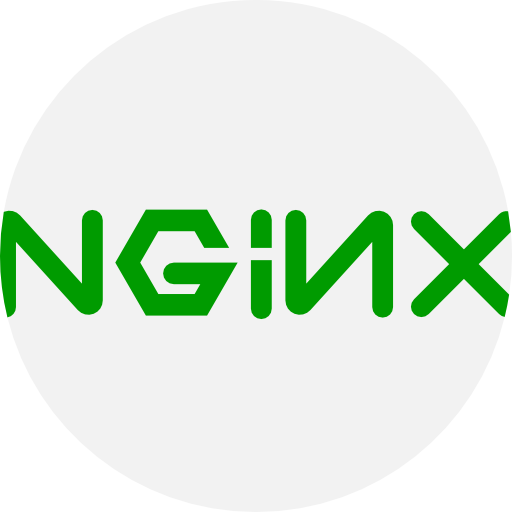
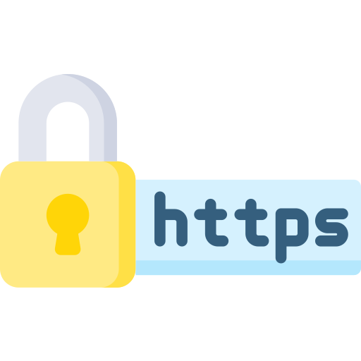
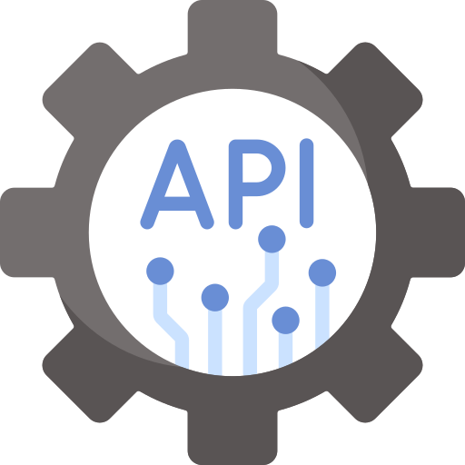
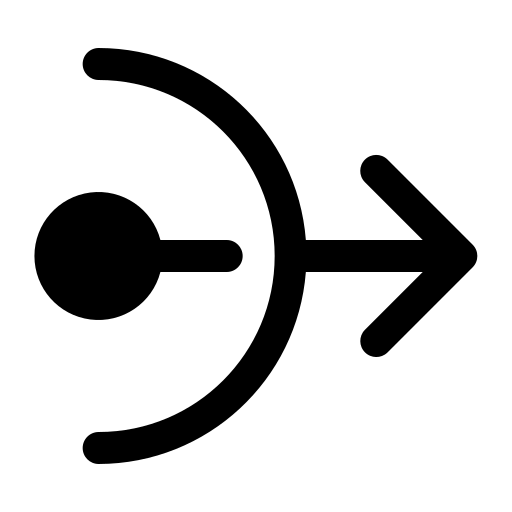
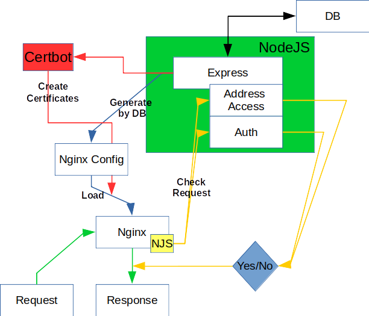
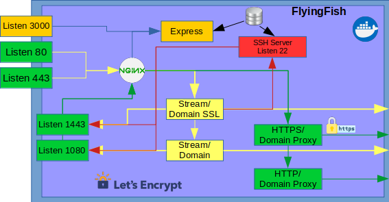

# Index
2. [Motivation](#motivation)
    * 1.1 [Important point](#important-point)
    * 1.2 [Idea integration](#idea-integration)
    * 1.3 [Flow diagram idea](#flow-diagram-idea)
    * 1.4 [Process/development](#processdevelopment)
    * 1.5 [Projectname](#projectname)
    * 1.6 [Extentions](#extentions)
        * 1.6.1 [Flyingfish-Shield](#flyingfish-shield)
        * 1.6.2 Flyingfish-Onion-Hat (TODO)
        * 1.6.3 Flyingfish-VPN-River (TODO)
        * 1.6.4 Flyingfish-Horde (TODO)
2. [Project-Parts](#project-parts)

## Motivation
I only got to know the Nginx server after Apache. And was pleasantly surprised by the configuration.
Some time ago I dealt with the topic of splitting several domains with destinations via the VPN via a bundled server.
I found a domain mapping/splitting in the Nginx newer version.
From another widely used project ([Nginx proxy manager](https://nginxproxymanager.com/), which is a very good project) I use a lot the creation of certificates (Letsencrypt).
I started the project and have a lot to learn myself, to incorporate my own ideas and extensions. It is another building block for other projects that I am making available to others.

#### Important point:

1. Creation of certificates
2. Proxy web calls
3. Domain splits
4. Remote port forwarding
5. Settings via a frontend
6. API certificate query for internal web servers in the internal network
7. and more ...

#### Idea integration
<table style="border: 0px;">
<tr>
<td>

</td>
</tr>
</table>

* Fast installation through Docker.

<table style="border: 0px;">
<tr>
<td>

</td>
<td>

</td>
<td>

</td>
</tr>
</table>

* In addition to the classic problem of providing HTTPS connections with Letsencrypt certificates, URI with a proxy to direct to internal web servers. Was the idea to use "SSH Remote Port forwarding" to forward a local web server via SSH (via the internet or internal network) so that it can be reached via Nginx with a valid HTTPs certificate.

<table style="border: 0px;">
<tr>
<td>

</td>
</tr>
</table>

* I see an advantage in testing projects that require an API connection or for rolling out a user-defined configuration that can be delivered securely using HTTPs.

<table style="border: 0px;">
<tr>
<td>

</td>
</tr>
</table>

* Using Upnp Nat so that the ports are automatically forwarded via the router. It is also possible to carry out a Nat with several routers.

<table style="border: 0px;">
<tr>
<td>

</td>
</tr>
</table>

* DynDns Client for updates by IP changes.
* DynLocation Client, a small program that uses an API key that gives FlyingFish the information where the server is in the network (with DHCP IP) and thus adjusts the location of Nginx, much like DynDNS.
  Helpful for developers.

#### Flow diagrams idea
#### Nginx & Express Action

#### Nginx & Express Streams

#### Upnp Client Nat

#### Process/development

Currently I will first generate simple configuration files for Nginx and feel the database by hand. A frontend will be developed step by step. I'm hoping for suggestions and other ideas. Write to me!

#### Projectname

The name of the project is an allusion to the fish that is "air" in an atypical environment for it. Nevertheless, the fish copes perfectly here. This is how I see the project with the Nginx server and the interacting components. The name also goes well with "Docker" a whale.

#### Extentions
As mentioned above "7. and more" I will include many extensions in the project, these can be used, but do not have to. I think that brings added value to the project in the form of more use cases.

##### Flyingfish-Shield
The shield is supposed to provide protection for the Nginx, or the application behind the Nginx. As shown above, the NJS module is implemented in Nginx. The IPs are checked via the Nginx stream. During my development with the module and the Upnp Nat, I noticed in the logs that constant IPs around the world were querying my unknown (and briefly living) server.
My research has shown that the IPs are already known and that IPs are from Internet scanners from all nations to uncover the network.

My idea for this is to take information from databases and projects that are already known and to block these IPs. In addition, I thought of adding a "knock" function. The "knock" triggers a ritual and then the IP is safely let through again. Maybe you can also join forces with other projects. I'll expand on this idea further later.

# Project-Parts
* Nginx Manager
* SSH-Server
* Onion/Tor-Service
* DynLocation (TODO)