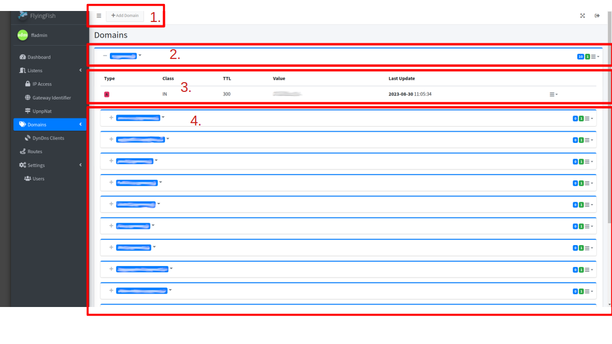
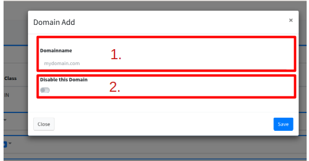

# Domains

The domains must be known for the DNS server or routes. These are stored in the domain list and can then be used in the routes.

<figure><figcaption>
Domain List
</figcaption></figure>

1. **Add Domain:** Opens the dialog for adding a domain.
2. List with the **"main domain"**. On the left is the name with the +/- all records and subdomains can be displayed. On the right side you can see the number of subdomains in blue and the number of records in green. Finally, the context menu can be opened for actions (edit, add record or delete).
3. The list of records for this domain.
4. List of subdomains which are again displayed like the main domain (tree structure).

## Add Domain

<figure><figcaption>
Add/Edit Dialog
</figcaption></figure>

1. **Domainname:** Enter the name of the domain here, e.g. example.com
2. **Disable this Domain:** Disables the domain in the DNS server and for the routes. All routes with the domain are skipped in the nginx config generation.
