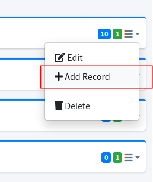
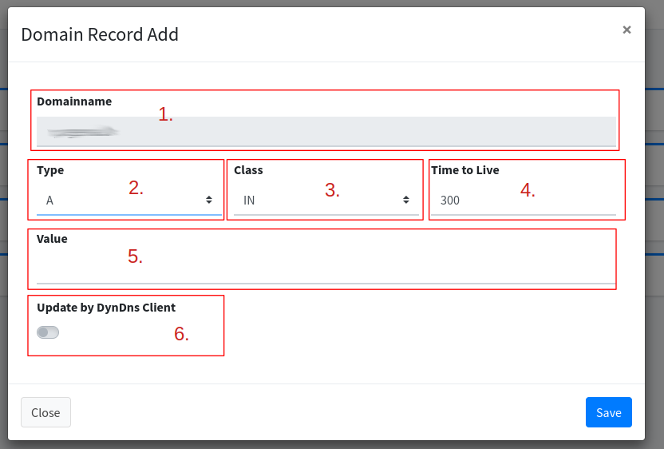

# Domains

The domains must be known for the DNS server or routes. These are stored in the domain list and can then be used in the routes.

<figure><figcaption>
Domain List
</figcaption></figure>

1. **Add Domain:** Opens the dialog for adding a domain.
2. List with the **"main domain"**. On the left is the name with the +/- all records and subdomains can be displayed. On the right side you can see the number of subdomains in blue and the number of records in green. Finally, the context menu can be opened for actions (edit, add record or delete).
3. The list of records for this domain.
4. List of subdomains which are again displayed like the main domain (tree structure).

## Add Domain

<figure><figcaption>
Add/Edit Dialog
</figcaption></figure>

1. **Domainname:** Enter the name of the domain here, e.g. example.com
2. **Disable this Domain:** Disables the domain in the DNS server and for the routes. All routes with the domain are skipped in the nginx config generation.

## Add Record

If you are also using the DNS server, you can enter the records for the domain.


A record contains the information, for example: IP, name or options. These are delivered to the request clients. [You can find out more here](https://de.wikipedia.org/wiki/Resource\_Record).


<figure><figcaption></figcaption></figure>

Choose the domain you want to add a record from.

<figure><figcaption></figcaption></figure>

1. **Domainname:** The name of the domain or subdomain (complete example: sub.example.com).
2. **Type:** The type for the record A for IPv4 or AAAA for IPv6. And more.
3. **Class:** Currently we only support "IN".
4. **Time to Live:** The time specification (in seconds) how long the domain queried by the client is valid.
5. **Value:** Content that is delivered to the client, for example, an IP.
6. **Update by DynDns Client**: Allows the DynDNS client to update this record. The IP will then be reset.
