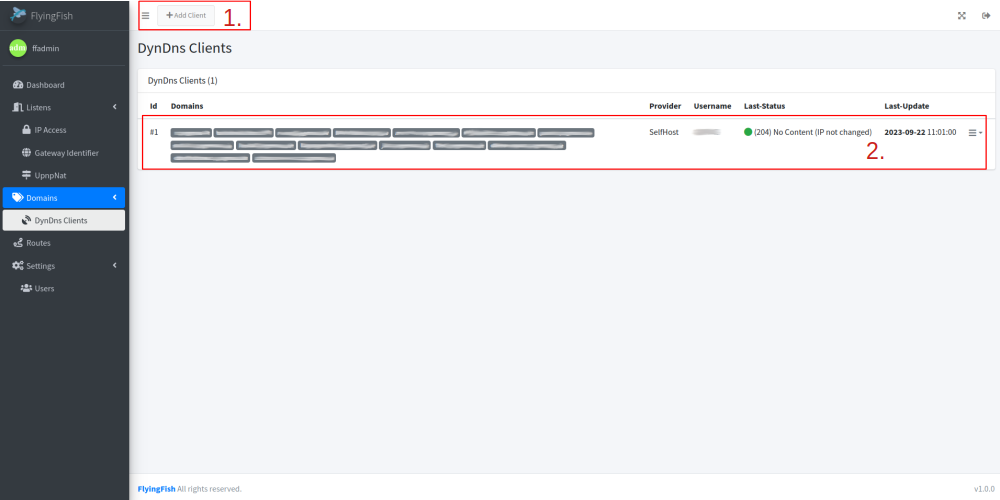
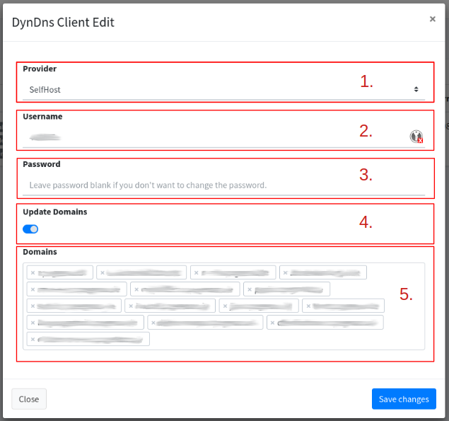

# DynDns Clients

With the DynDNS Client, an account can be stored that reports the current IP of the router (IP on the Internet) to the provider and updates the IP in the domain record.

<figure><figcaption>
<a href="https://www.meme-arsenal.com/en/create/meme/11162684">Generated</a>
</figcaption></figure>

## List

All set up clients with the domains can be seen in the list. With the status you can see whether the IP has currently been delivered.

<figure><figcaption></figcaption></figure>

1. Add a new Client for DynDNS.
2. An entry with all important information. All domains that are being updated can be seen.

## Edit

Use the dialog to edit or create a new client.

<figure><figcaption></figcaption></figure>

1. **Provider**: Select a provider for DynDNS. (Currently only "Selfhost" is supported.)
2. **Username**: Username at the provider.
3. **Password**: Password from the account with the provider.
4. **Update Domains**: Activate the updating of the domains (the A records) in the [domain list](./) (for your [own domain server](own-dns-server.md)).
5. **Domains**: If 4. is active, the following selected domains will be updated.
