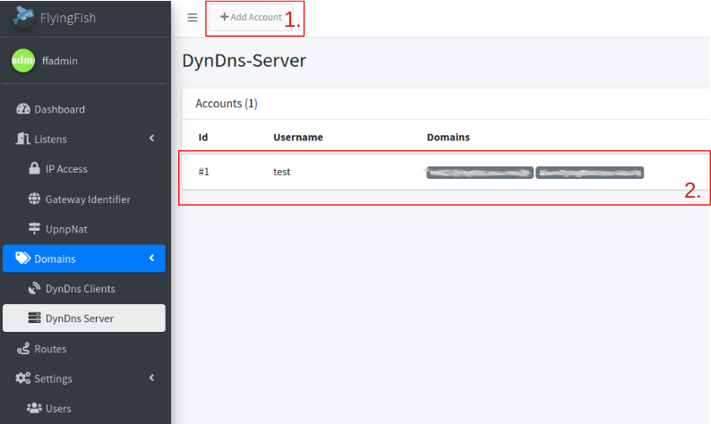
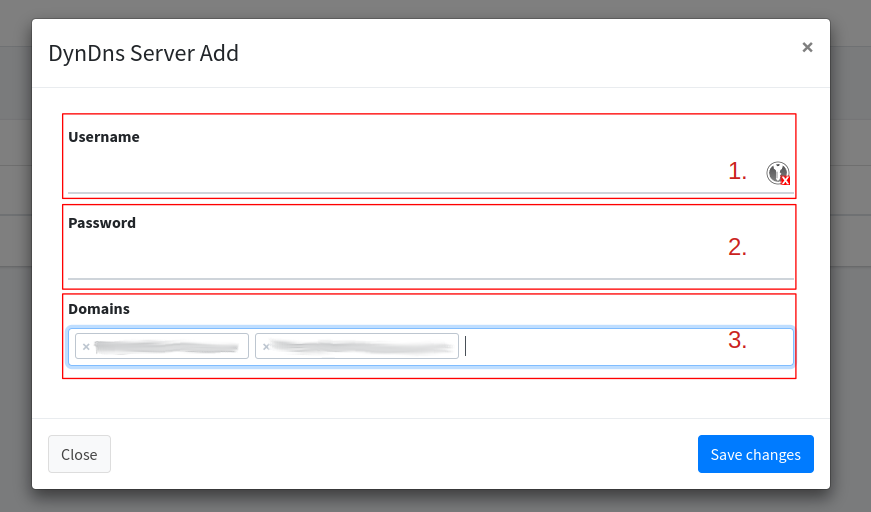

# DynDns Server


The DynDns-Server was introduced from [version v1.0.24](#user-content-fn-1)[^1].


With the DynDns-Server, third DynDns clients can submit their IP update for a domain. Both extra accounts and domains can be stored. For example, a 'Fritz box' can give its IP for a domain to the [DNS server](own-dns-server.md).

## List

<figure><figcaption></figcaption></figure>

1. Adds a new account.
2. List of accounts.

## Add/Edit

Add/Edit an account where a DynDns client can log in and submit its update.

<figure><figcaption></figcaption></figure>

1. Username for Login.
2. Password for user.
3. Domains for the update.


[To set up the router or DynDNS client, read the example for more information.](../../examples/own-dyndns-server-fritzbox.md)


[^1]: 
