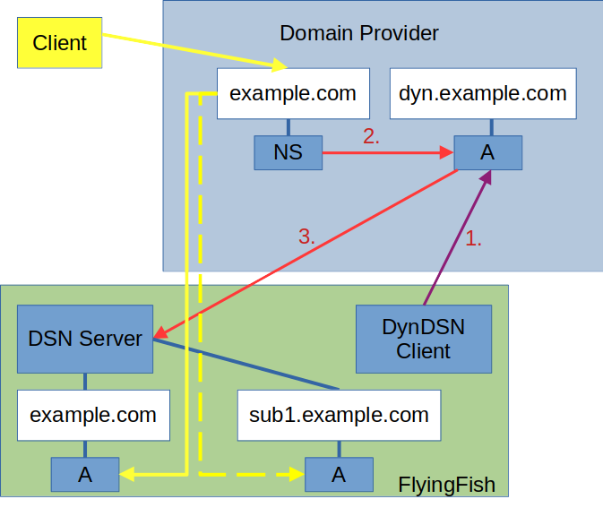
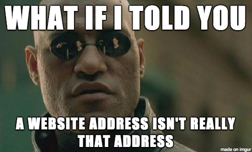

# Own DNS Server

## Theory

The FlyingFish DNS server will never be an official root DNS server. He could only do that if the router or PC directly enters the IP from the DNS server. For example, the DHCP could distribute the DNS IP.


But here I will describe how the DNS server can officially manage a sub DNS server for online query subdomains.


If you have received your domain from the DNS administrator, you can manage the records yourself in the provider's portal.&#x20;

Example if you own the <mark style="background-color:purple;">example.com</mark> domain, you can manage the subdomains for this domain in FlyingFish, e.g. <mark style="background-color:purple;">sub1.example.com</mark>.

<figure><figcaption></figcaption></figure>

A domain <mark style="background-color:purple;">example.com</mark> gets an <mark style="background-color:red;">NS</mark> (name server) record from the provider. These records can only point to domain names. In addition, we create a subdomain <mark style="background-color:purple;">dyn.example.com</mark> who's <mark style="background-color:red;">A</mark> record gets the IP from our DynDNS client/or fixed IP. DNS servers are backwards resolving. That means if a <mark style="background-color:purple;">sub1.example.com</mark> is called but not found, <mark style="background-color:purple;">example.com</mark> is called. However, this does not return an <mark style="background-color:red;">A</mark> record, only the <mark style="background-color:red;">NS</mark> record. Now the client knows he must request a DNS server under the domain <mark style="background-color:purple;">dyn.example.com</mark>. With its IP resolution it gets the IP from the FlyingFish DNS server. Then the client asks this DNS server again and gets <mark style="background-color:purple;">sub1.example.com</mark> an <mark style="background-color:red;">A</mark> record.

In the diagram you can see how the flow works:

1. The DynDNS client delivers the IP and writes it to <mark style="background-color:purple;">dyn.example.com</mark> A Record.
2. The domain <mark style="background-color:purple;">example.com</mark> points to an NS record on domain <mark style="background-color:purple;">dyn.example.com</mark>.
3. The <mark style="background-color:purple;">dyn.example.com</mark> record now sends the DNS client to our FlyingFish DNS server.


From now on we can manage all sub domains and example.com ourselves with our own records.


<figure><figcaption></figcaption></figure>

## Practice

I myself use the provider "Selfhost" which I can recommend for this setup.

