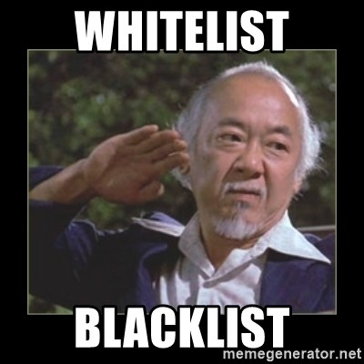

# IP Access

<figure><figcaption>
In what way is your cup full?
</figcaption></figure>

In my development phase, I noticed that I received many requests on my dynamic IP (from my ISP). After checking what kind of requests were, I wanted to stop them. Many of these requests are bots from giant companies scouring the web. But also many hackers who do not make valid requests but try to break into the server.

## Whitelist

IP addresses from the whitelist are allowed to connect. All other addresses that are not noted will be blocked.

## Blacklist

IP addresses that are in the blacklist will be blocked. What is special about the blacklist is that it is compared with a public blacklist every 24 hours.

<figure><figcaption>
;)
</figcaption></figure>

