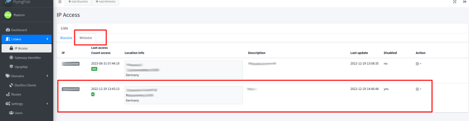
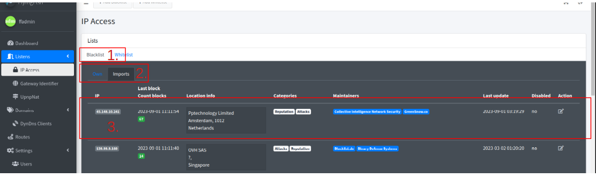
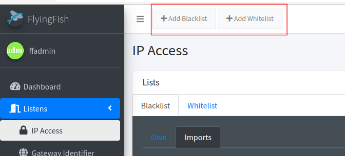
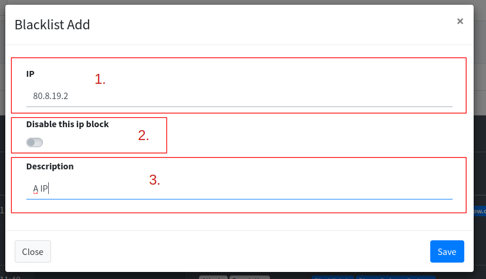

# IP Access

<figure><figcaption>
In what way is your cup full?
</figcaption></figure>

In my development phase, I noticed that I received many requests on my dynamic IP (from my ISP). After checking what kind of requests were, I wanted to stop them. Many of these requests are bots from giant companies scouring the web. But so many hackers who do not make valid requests but try to break into the server.

## Whitelist

IP addresses from the whitelist are allowed to connect. All other addresses that are not noted will be blocked.

<figure><figcaption>
Whitelist
</figcaption></figure>

You can switch to the whitelist with a tab. In a list you see all IPs that are whitelisted. In the second column you can see when and how often a query was started from this IP.


Only IPs that are whitelisted can make a request. All other IPs are automatically blacklisted.


## Blacklist

<figure><figcaption>
Blacklist imports
</figcaption></figure>

1. **Tab for Blacklist:** There are more tabs under the blacklist.
2. **Tab for Own/Imports:** Here you have two lists. Once the list of self-entered IPs that are blocked. Or the imported list.
3. **Entry of import blacklisting:** Here you can see the information about what is known under the IP and when it last tried to access it. The list is sorted by the last accesses.


IP addresses that are in the blacklist will be blocked. What is special about the blacklist is that it is compared with a public blacklist every 24 hours.


<figure><figcaption>
;)
</figcaption></figure>

## Add IP to White-/Black-list

<figure><figcaption>
Buttons for add Black/White-Rule.
</figcaption></figure>

The dialog for the blacklist and whitelist are identical.

<figure><figcaption>
Dialog
</figcaption></figure>

1. **IP**: IP to block or allow through.
2. **Disable this ip block**: Disables the rule if the rule should not be deleted.
3. **Description**: A description can be given of what is known about the IP.
