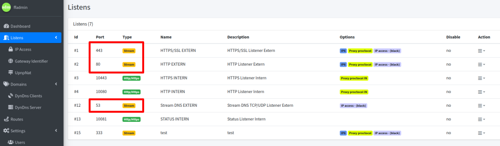
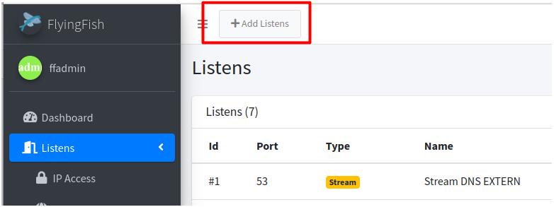
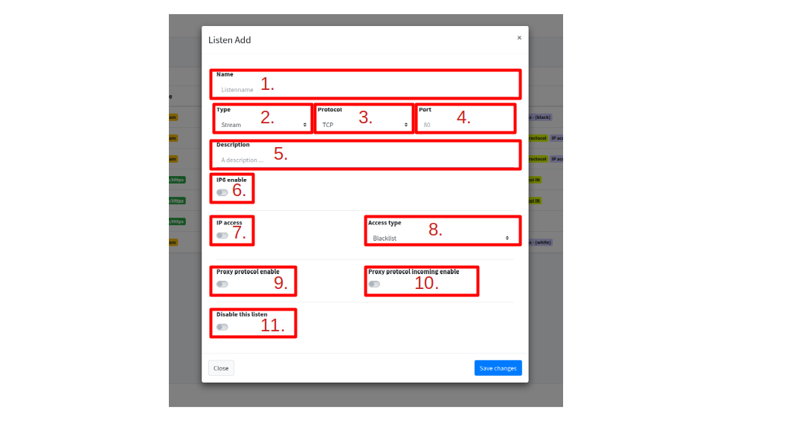
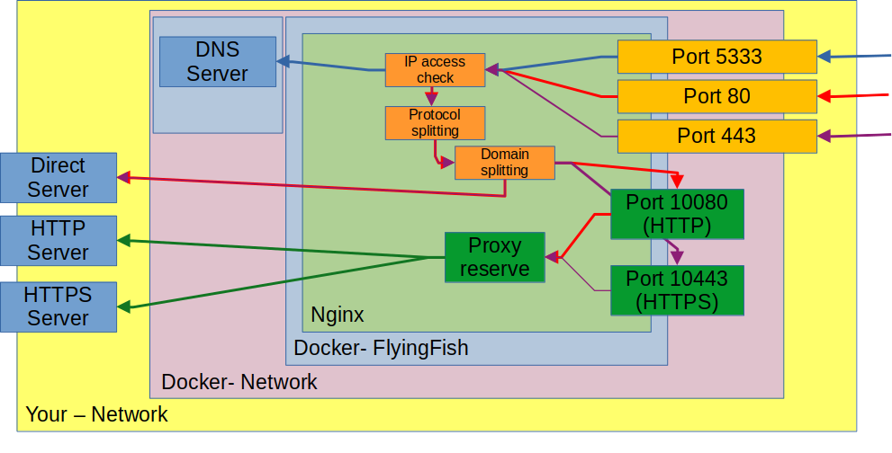

# Listen

<figure><figcaption></figcaption></figure>

The ports specified here come from the web interface and are used by nginx intern docker container.

| Port         | Description               |
| ------------ | ------------------------- |
| 80 (TCP)     | HTTP Protocol             |
| 443 (TCP)    | HTTPS/SSH/SSL Protocols\* |
| 53 (TCP/UDP) | DNS Protocol              |

These ports are internal to nginx of type "Stream". You can see a port overview again in [port forwarding](port-forwarding.md).

<figure><figcaption>
Standard listen ports by setup
</figcaption></figure>

If you only use the standard ports for your services, you do not need to enter any additional ports here.

## Add/Edit Listen

<figure><figcaption>
Add Listen
</figcaption></figure>

Add a list, a dialog follows that also appears when editing.

<figure><figcaption></figcaption></figure>

1. **Name:** Name your list, so you always recognize it in the UI.
2. **Type:** Type of listening from Nginx Proxy. Stream or HTTP/HTTPS, the difference is how the connection is handled.
3. **Protocol:** Which protocol should be used, UDP can also be used in addition to TCP for a stream.
4. **Port:** Which port the listening is listening on.
5. **Description:** Here you can describe in more detail what the listener is used for.
6. **IP6 enable:** Additionally enables listening on an IP6 address <mark style="background-color:orange;">(untested yet, but enables it in the nginx config)</mark>.
7. **IP access:** Enables checking of the IP address against a list (blacklist/whitelist).
8. **Access type:** Which list to use for the IP check. The lists can be maintained under [IP Access](ip-access.md).
9. **Proxy protocol enable:** Activates the use of the proxy protocol. From now on all packets are provided with the Proxy Protocol header. <mark style="background-color:blue;">This setting is important for internal HTTP/HTTPS processing.</mark> Only in this way does the route get the correct IP of the inquiring request for further checks or logging.
10. **Proxy protocol incoming enable:** Enables expecting a packet with a proxy header. Should the FlyingFish sit behind another proxy server with a proxy protocol.
11. **Disable this listen:** Disables listening, settings are skipped during nginx config build. <mark style="background-color:blue;">All dependent routes are also skipped.</mark>

After the initial installation, you can view the automatically installed listeners. You will find that ports 80 and 443 work with the proxy protocol. There is a good reason for this, since the stream points to the internal HTTP/HTTPS servers (lists). Which in turn expect the proxy protocol to process the correct IP from the request and not the IP 127.0.01.


Save causes an immediate reload of nginx. Existing connections are kept as if running the command: nginx -s reload


## Listen flow

The following graphic should help to understand the list process:

<figure><figcaption>
Portsflow
</figcaption></figure>

<mark style="background-color:yellow;">Port 5333, 80, 443 Listening</mark> on the network from the host (as a bridge, port forwarding to the Docker container). &#x20;

There the Nginx first <mark style="background-color:orange;">"</mark>[<mark style="background-color:orange;">IP access check"</mark>](ip-access.md) whether the IPs have access rights. Then the streams (TCP/UDP) are <mark style="background-color:orange;">split into their protocol</mark> (SSL/HTTP/etc.) and <mark style="background-color:orange;">split into</mark> [<mark style="background-color:orange;">domains</mark>](domains.md) for forwarded to a destination. Should not specify an external destination. The internal ports for the <mark style="background-color:green;">HTTP and HTTPS server</mark> are specified as standard. They perform a <mark style="background-color:green;">"proxy reserve"</mark> and request a route too <mark style="background-color:blue;">internal or external HTTP/HTTPS server</mark>.&#x20;


The internal ports are only accessible in the Docker network and are securely shielded from the public network. It must pass stream ports 5333, 80, 443 via a query.

