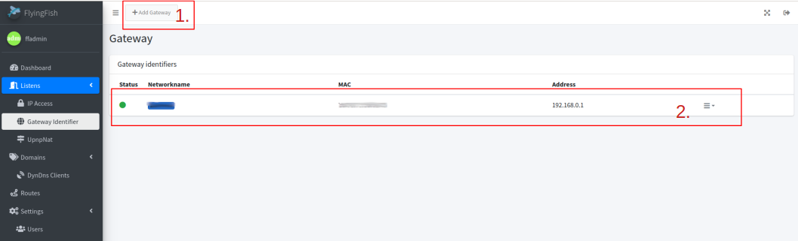
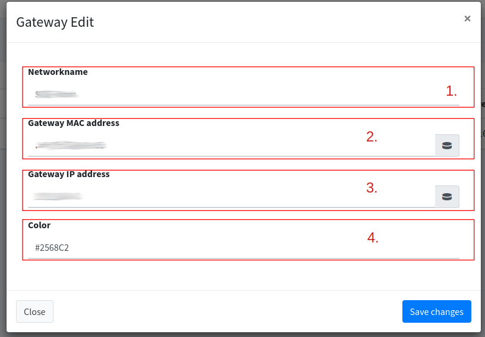

# Gateway identifiers

<figure><figcaption>
What network is FlyingFish on?
</figcaption></figure>

FlyingFish uses network detection (detection of the router through which the internet can be reached). Settings depend on the network and automations are triggered depending on network detection, e.g. Upnp Nat.


I also use Flying Fish to develop locally on my computer, so my computer often changes networks. This means that the correct port forwarding can be set up automatically for each router.


## List

You can see all gateways in the list. FlyingFish shows a green dot which gateway it finds itself in.


The gateway would be recognized based on the MAC of the router.


<figure><figcaption></figcaption></figure>

1. Adds a gateway.
2. Entry of a gateway.

## Add a Gateway

The settings for the gateway can be quickly made here.

<figure><figcaption></figcaption></figure>

1. **Networkname**: Name for the network in which the router is located.
2. **Gateway MAC address**: The MAC address can be entered here by hand or using the button on the right. FlyingFish fills in the recognized network router MAC using the button.
3. **Gateway IP address**: The IP address can be entered here by hand or using the button on the right. FlyingFish fills in the recognized network router IP using the button.
4. **Color**: Color for recognition.
