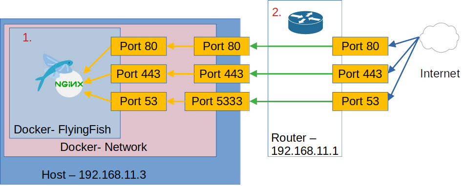

# Port forwarding

<figure><figcaption>
Port flow
</figcaption></figure>

Should have installed [FlyingFish by default](../../installation/quick-setup.md). [Ports 80, 443, 5333](../../installation/long-setup/docker-compose/ports.md) can be reached on the host system. These ports must now be accessible from the Internet.

The ports must be released from your router (in my example from the address 192.168.11.1) to the server (in my example the address 192.168.11.3). From 2nd to 1st, port 80 must be forwarded to 80 (tcp), 443 to 443 (tcp) and 53 to 5333 (udp and tcp).


You have to research online how to set up your router. Since the routers differ from each manufacturer.


**Collection of links for known routers:**

* [FritzBox 7590](https://en.avm.de/service/knowledge-base/dok/FRITZ-Box-7590/34\_Setting-up-port-sharing-in-the-FRITZ-Box/)
