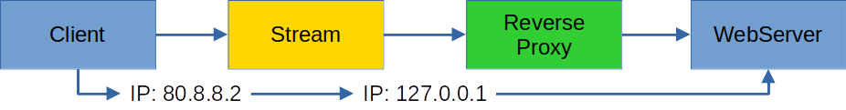
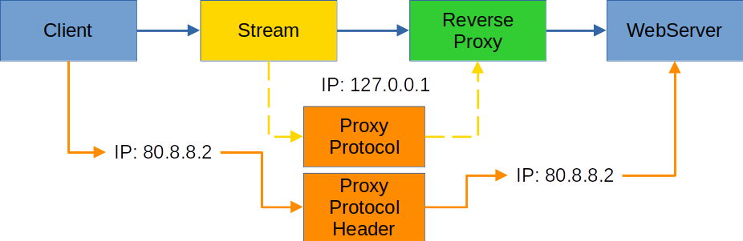

# Proxy protocol

As already mentioned in [Listen](./), a stream forwarded by Nginx cannot include the source IP. We help ourselves by activating the proxy protocol. As a result, the packet is taken and the information from the original IP is stored at the beginning.

<figure><figcaption></figcaption></figure>

As can be seen in the diagram, the stream still receives the original IP from the querying <mark style="background-color:blue;">client</mark>. As soon as the <mark style="background-color:yellow;">stream</mark> connects to the <mark style="background-color:green;">reverse proxy</mark>, this is an internal connection with 127.0.0.1. The information is lost from the reverse proxy for the <mark style="background-color:blue;">web server</mark>.

<figure><figcaption></figcaption></figure>

With the <mark style="background-color:orange;">Proxy protocol</mark>, the <mark style="background-color:green;">reverse proxy</mark> receives the original IP with the package extension of the <mark style="background-color:orange;">Proxy protocol header</mark> and can pass it on to the <mark style="background-color:blue;">web server</mark>.

You can read more about it at [Exploring the proxy protocol](https://seriousben.com/posts/2020-02-exploring-the-proxy-protocol/).

<figure><figcaption>
Okay, a bit exaggerated ...
</figcaption></figure>
