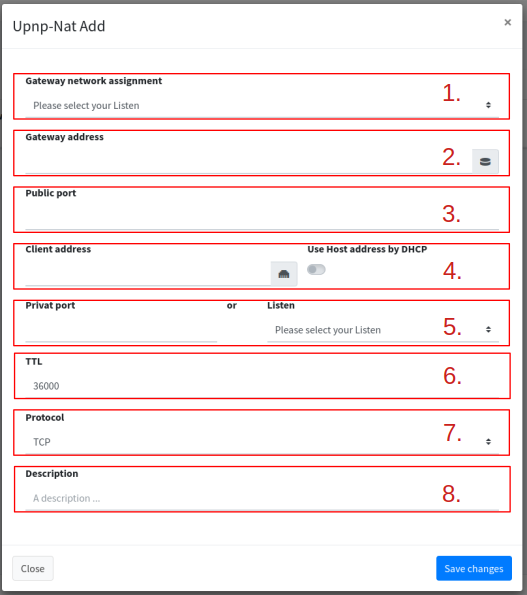

# Upnp Nat

Upnp Nat Client helps to automatically enable port forwarding depending on the network ([gateway identifiers](gateway-identifiers.md)) on the router.


Upnp-Nat must be activated on the router. With the Fritzbox you have to allow Upnp-Nat for a host device.


## Add

Adds upnp-nat port forwarding:

<figure><figcaption></figcaption></figure>

1. **Gateway network assignment**: Select your gateway. The gateways of "[Gateway identifiers](gateway-identifiers.md)" are displayed here.
2. **Gateway address**: Enter the IP address of the gateway (router) on which UpnpNat is requested.
3. **Public port**: Port that is opened to the Internet.
4. **Client address**: Enter the target IP address here. If it is FlyingFish and not another application from another system, you can simply use the "Use Host address by DHCP".&#x20;


When activating "Use Host address by DHCP" the host's IP, which it received as an IP, is always used automatically.


5. **Privat port**: Here you enter the port which is located in the network and which should be released to the outside world on the Internet.  Or select a [Listen](./) directly.
6. **TTL**: The time (in seconds) for how long the port forwarding requested by the client is valid. Default is 36000 seconds.
7. **Protocol**: What protocol is used for port forwarding? The router then only passes on this protocol. TCP and UDP can be selected.
8. **Description**: Description for port forwarding.
