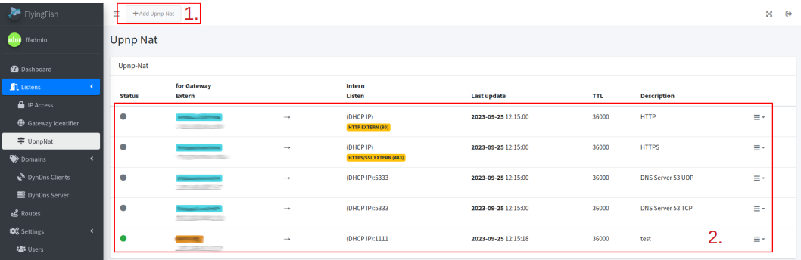
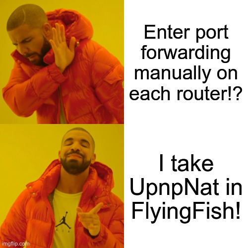

# UPnP Nat

UPnP Nat Client helps to automatically enable port forwarding depending on the network ([gateway identifiers](gateway-identifiers.md)) on the router.


Upnp-Nat must be activated on the router. With the Fritzbox you have to allow UPnP-Nat for a host device.


## List

All port forwarding can be seen in the list, per [Gateway identifiers](gateway-identifiers.md) and [Listen](./)/port.

<figure><figcaption></figcaption></figure>

1. Adds a new port forwarding for UPnP Nat.
2. Entries for UPnP Nat.

#### Status

Gray status shows that we are not currently in the gateway, these port forwarding are being ignored.&#x20;

A <mark style="color:red;">red status</mark> indicates that port forwarding could not be set up automatically. This could be a problem with:


* UPnP Nat is not active on the router
* The device does not have permission for UPnP Nat. (e.g. Fritzbox)
* The port is already taken and cannot be released again.


The <mark style="color:green;">green status</mark> indicates that port sharing has been set up.

## Add

Adds UPnP Nat port forwarding:

<figure><figcaption></figcaption></figure>

1. **Gateway network assignment**: Select your gateway. The gateways of "[Gateway identifiers](gateway-identifiers.md)" are displayed here.
2. **Gateway address**: Enter the IP address of the gateway (router) on which UPnP Nat is requested.
3. **Public port**: Port that is opened to the Internet.
4. **Client address**: Enter the target IP address here. If it is FlyingFish and not another application from another system, you can simply use the "Use Host address by DHCP".&#x20;


When activating "Use Host address by DHCP" the host's IP, which it received as an IP, is always used automatically.


5. **Privat port**: Here you enter the port which is located in the network and which should be released to the outside world on the Internet.  Or select a [Listen](./) directly.
6. **TTL**: The time (in seconds) for how long the [port forwarding](port-forwarding.md) requested by the client is valid. Default is 36000 seconds.
7. **Protocol**: What protocol is used for [port forwarding](port-forwarding.md)? The router then only passes on this protocol. TCP and UDP can be selected.
8. **Description**: Description for [port forwarding](port-forwarding.md).

<figure><figcaption>
Generate by <a href="https://imgflip.com/i/80bxpq">https://imgflip.com/i/80bxpq</a>
</figcaption></figure>
