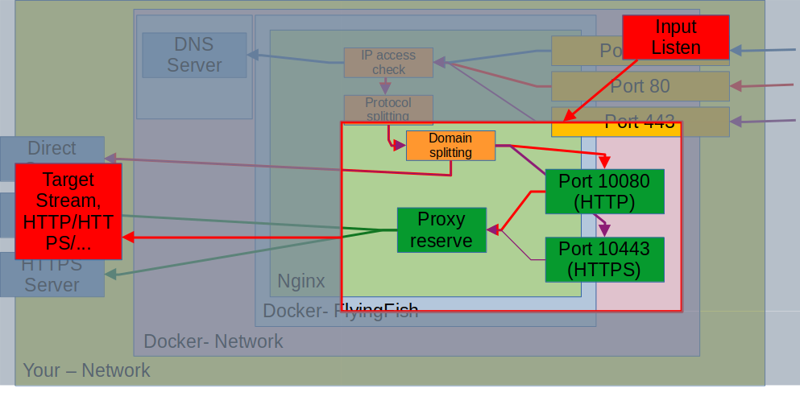
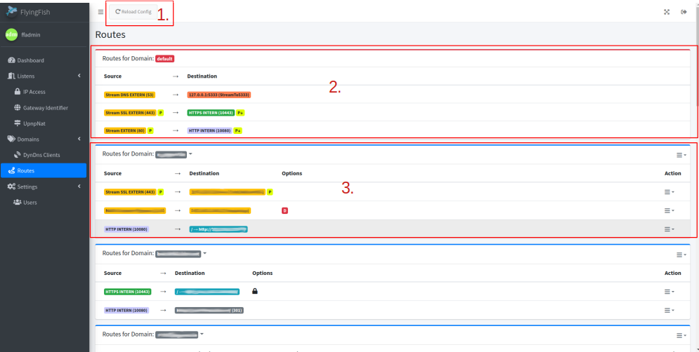
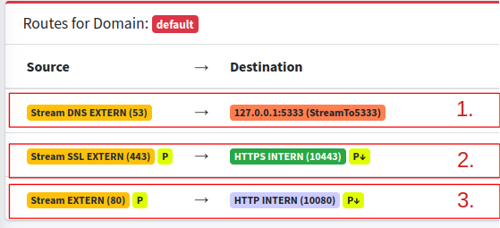
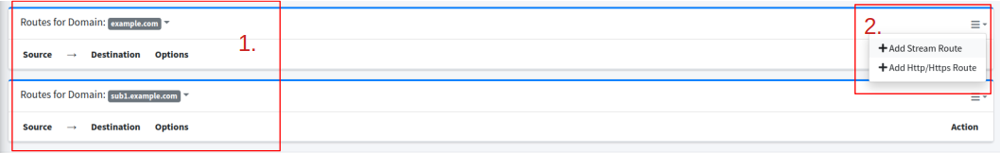
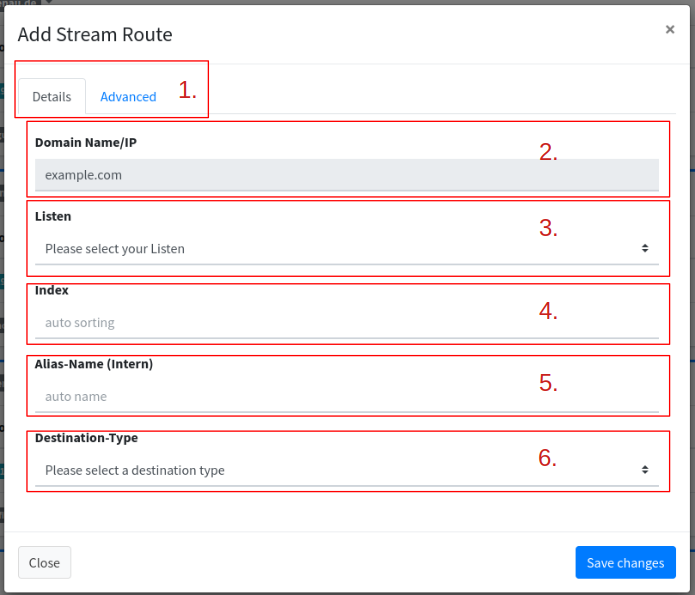
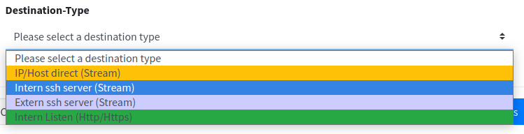
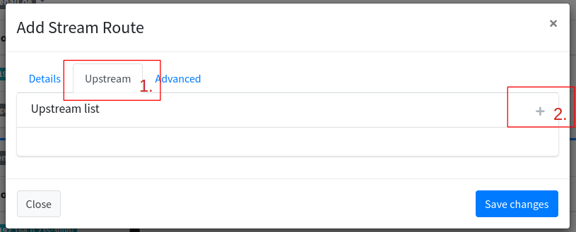
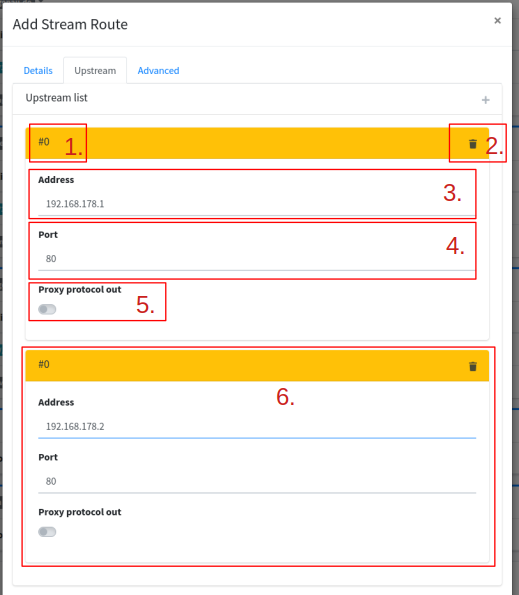
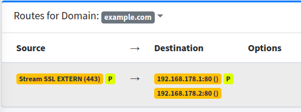
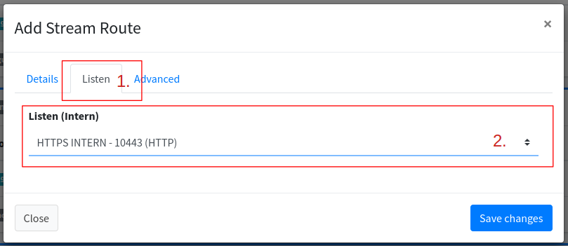

# Routes

A route is a path from the input ([Listen](listen/)) to the destination. The destination can be of different types, stream, HTTP/HTTPS, SSH, use.

With the help of the [graphic from Listen](listen/#listen-flow) I would like to show the area controlled by the route again:

<figure><figcaption>
Listen and Routes
</figcaption></figure>

## Routes List

<figure><figcaption>
Routes list
</figcaption></figure>

1. The new creation and loading of the configuration of the nginx (all Listen, Routes, etc.) can be triggered again manually at any time.


Existing connections are kept as if running the command: nginx -s reload


2. The first thing to see in the Routes list are the default routes. If no route is specified, the default routes always apply.
3. Each domain entered in [Domains](domains/) is displayed under Routes. One or more routes from one or more [Listen](listen/) to a destination can now be entered.

## Default Routes

<figure><figcaption>
Default routes
</figcaption></figure>

The default Routes are installed at the beginning of the [setup](../installation/). These routes are the default path if no domain or protocol split takes effect beforehand.


The default routes cannot be edited or deleted.


1. The <mark style="background-color:orange;">listen stream on port 53</mark> points to FlyingFish's internal <mark style="background-color:red;">DNS server</mark> (this lists on port 5333 so that nginx can get port 53).&#x20;
2. The <mark style="background-color:orange;">listen stream on port 443</mark> points to the internal <mark style="background-color:green;">HTTPS service</mark> with port 10443. HTTPS connections are handled with certificates.
3. The <mark style="background-color:orange;">listen stream on port 80</mark> points to the internal <mark style="background-color:green;">HTTP service</mark>, no encryption with a certificate is used.&#x20;


If set for [listening](listen/), the [IP access blacklist/whitelist](ip-access.md) takes effect.


The yellow "<mark style="background-color:yellow;">P</mark>" can also be seen on point <mark style="color:red;">2</mark> and <mark style="color:red;">3</mark>. It indicates that the connection with [Proxy protocol](listen/proxy-protocol.md) is activated. On the target side you can see the "<mark style="background-color:yellow;">P</mark>" with an arrow pointing down. It shows that the [Proxy protocol](listen/proxy-protocol.md) is removed again.


If no P with an arrow appears at the destination, the [Proxy protocol](listen/proxy-protocol.md) will be passed on to the remote server! This remote server must expect the [Proxy protocol](listen/proxy-protocol.md), otherwise it will not understand this connection!


## Add Stream/Route

<figure><figcaption>
Routes list, example domains
</figcaption></figure>

1. If the two domains <mark style="background-color:purple;">example.com</mark> and <mark style="background-color:purple;">sub1.example.com</mark> are created under [Domains](domains/), we can now see them in Routes.
2. Adding a <mark style="background-color:orange;">Stream</mark> or <mark style="background-color:green;">HTTP/HTTP</mark>s route can be clicked in the context menu on the right, per domain. A domain can have multiple <mark style="background-color:green;">Stream</mark>s or <mark style="background-color:green;">HTTP/HTTP</mark>s routes.

## Add Stream

<figure><figcaption>
Stream dialog
</figcaption></figure>

1. **Tabs**: The tabs offer targeted setting options for the stream. Depending on the destination type (6.), the tabs expand with more setting options.
2. **Domain Name/IP**: Here we can see again which domain we are adding the stream to.
3. **Listen**: Which [Listen](listen/) entry our route accesses/acts to can be selected here.
4. **Index**: The index indicates the order in which our routes are sorted. 0 would come first, with all higher numbers following downwards. This may be necessary if a route has a higher priority. If there is no priority, this field can be left empty.
5. **Alias-Name (Intern)**: A name used internally in the Nginx config. The name helps when checking the config. But can be left empty because it is generated automatically.
6. **Destination-Type**: The type of target changes depending on the selection above the tab (under 1.) with further settings.

### Stream Destination-Type

<figure><figcaption></figcaption></figure>

#### <mark style="background-color:orange;">IP/Host direct (Stream)</mark>

<figure><figcaption></figcaption></figure>

1. IP/Host direct (Stream) adds a new tab where upstreams can be added.
2. An upstream can be added here.

<figure><figcaption>
Stream Dialog with upstreams
</figcaption></figure>

1. **#**: ID of the upstream, purely informative
2. Deletes the upstream entry.
3. **Address**: Destination IP address to which the requests are forwarded.
4. **Port**: Specification of which port the destination has.
5. **Proxy protocol out**: Activation removes the [Proxy protocol](listen/proxy-protocol.md) header. In the routes list it is indicated with "<mark style="background-color:yellow;">P</mark>" down arrow.
6. The second upstream added as an example. If upstream 1 with IP 192.168.178.1 cannot be reached, upstream 2 with IP 192.168.178.2 is used.

<figure><figcaption>
I have activated the upstream 192.168.178.1 proxy protocol out.
</figcaption></figure>

#### <mark style="background-color:green;">Intern Listen</mark>

<figure><figcaption></figcaption></figure>

1. The destination type <mark style="background-color:green;">Intern Listen (Http/Https)</mark> adds the Listen tab.
2. The [Listen](listen/) for Internal are now available for selection.


It only makes sense to set this internal listen in the stream if you have added a new custom internal listen (Http/Https) service under [Listen](listen/), deviating from the already supplied 10443 port or 10080 port. If you remember, there are [default routes](routes.md#default-routes) that take the path from the stream to HTTP/HTTPs from port 443 and 80. Therefore, you do not have to specify this path yourself!


