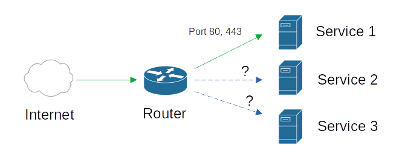
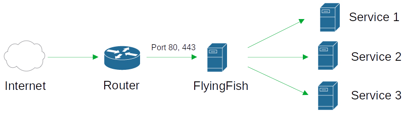
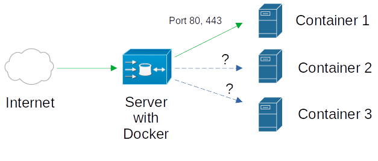
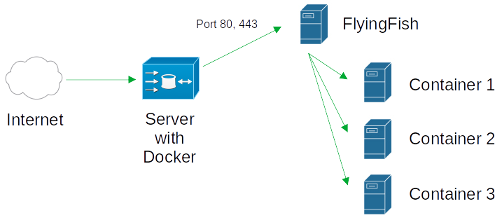

# Which user type am I

<figure><figcaption>
Image generated by an AI with MIT license
</figcaption></figure>

## Type 1, server is behind the router

It is usually the case that if there is a server behind the router, the router has to open the ports. This router can get a dynamic IP from the provider or has a fixed IP. According to what we find, some things still need to be done.

<figure><figcaption>
Enable only one service without reverse proxy.
</figcaption></figure>

Without a reverse proxy, only one of the services can be shared on the internet. The others can no longer use the ports on the router.

It may be possible to install multiple services on one host. But it can mean a huge effort. Or the dependencies of the system or software do not allow installing multiple services on one host. There can be many reasons. In general, separating the service on several hosts is the better solution.

<figure><figcaption>
With FlyingFish (reverse proxy) separation for each service.
</figcaption></figure>

### **Ports** forwarding to the FlyingFish

The ports can be forwarded with a router in the following ways:

* **ports Fixed** setting on the router
* **with** UPnP-Nat, you have to check whether UPnP-Nat is activated on the router, for example a "Fritz box" can be determined which computer is allowed to do this.

## Type 2, server is online

An online server can itself provide multiple services in virtualization, containers or a second server. With a fixed IP, all ports (if a firewall exists, this must be configured) should be directly addressable on the Internet.

<figure><figcaption>
Only one container can be released on the ports.
</figcaption></figure>

A typical setup could be with Docker on the server. FlyingFish would start here as another container.

<figure><figcaption>
With FlyingFish (reverse proxy) separation for each container.
</figcaption></figure>

## Summary

If Type 1 was often used in small companies or privately, Type 2 can also be used to manage servers online. The difference is the way the ports are accessed. This should give a small overview of how FlyingFish can be used. This use of FlyingFish is of course somewhat broken down and can of course also be used in complicated structures. For this reason, FlyingFish was also created to be able to set and control everything with a simple web interface. If you are unsure what structure you are building, sketching like the diagrams above can help.

If you have any questions, you are always welcome to  [create an issue](https://github.com/stefanwerfling/flyingfish/issues) on GitHub.
