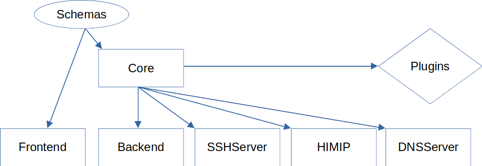
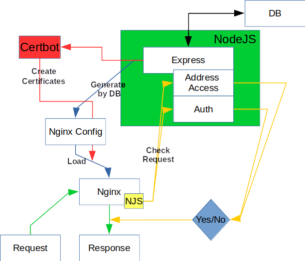

# Service structure

Here you will find an overview of how the project is structured and what connections exist.

## Extends structure

The advertisement was separated into several parts modules. <mark style="background-color:blue;">Schemas</mark> contain the structures of the data. The <mark style="background-color:purple;">Core</mark> combines functionalities that almost all services need.

<figure><figcaption></figcaption></figure>

<mark style="background-color:green;">Plugins</mark> can be loaded for each service via the core.

## Structure & Event communication

<figure><figcaption></figcaption></figure>

