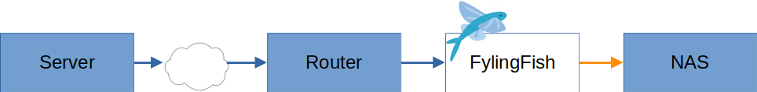
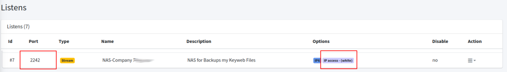
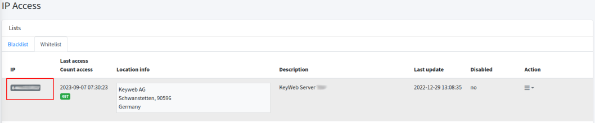
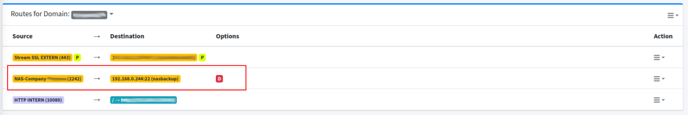
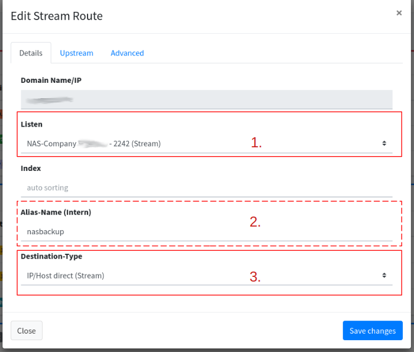
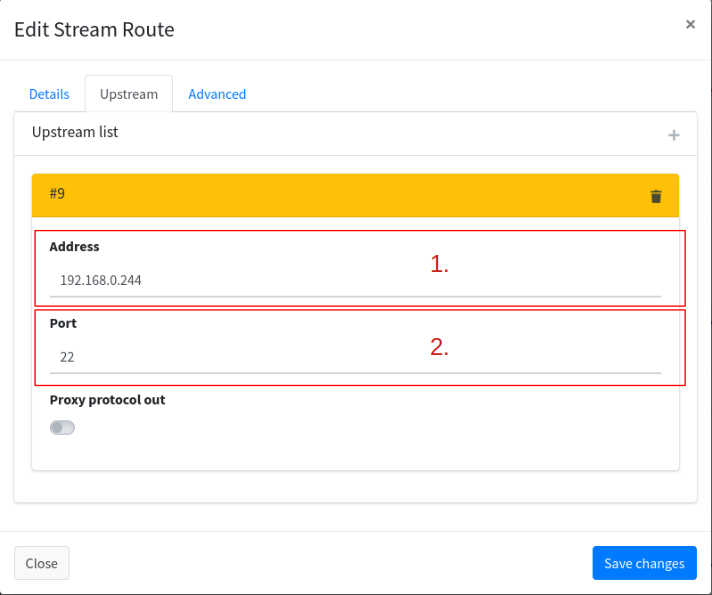
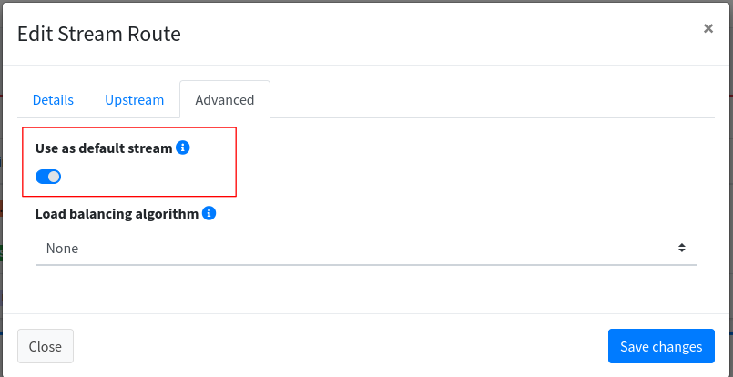
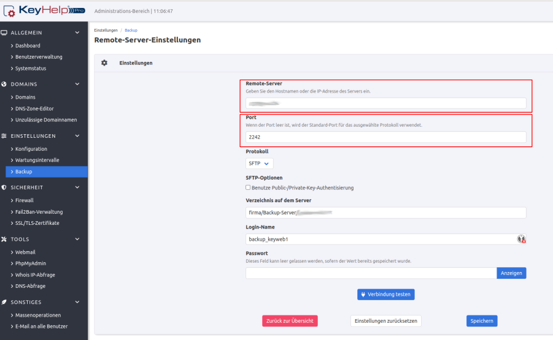
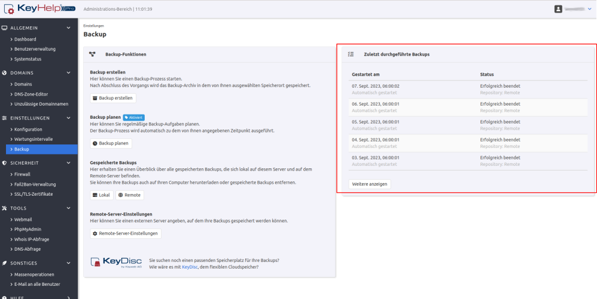

# Backup Server, SSH to Nas

## Start

The starting point. I own a server from the company "KeyWeb". This can automatically create backups to a remote target. The target is my NAS with an SSH release. The way to my NAS leads through a router.

## Problem

There are many brute force attempts on the SSH port. The port was immediately forwarded to the NAS. The NAS always sent emails/notification that there were too many login attempts.

##

<figure><figcaption></figcaption></figure>

## Thoughts

1. We could rely on the NAS for what it is......okay no we can't.
2. We could set up a complicated service on the side behind the router that would pick up my backup. But that's not a nice option.
   1. I have to maintain extra settings.
   2. I'm wasting space on my server, especially when the backup failed to download.

## Solution

Beat me, but I use the Nginx, more precisely my FlyingFish! Having full control over who even connects is a great feeling. It's like your own front door, only the people you expect come in there. Not everyone goes through and stands in front of the safe and tries the combination.

I now use my own "[Listen](../configurations/listen/)", [Whitelist](../configurations/listen/ip-access.md#whitelist) and a [route](../configurations/routes.md) with "[Stream](../configurations/routes.md#add-stream)" for this.


Now some routers can definitely do this. The difference, however, is that FlyingFish also logs this, and we can see the connections (counts, etc.).


Do we already have FlyingFish running, an optimal solution!

<figure><figcaption></figcaption></figure>

## Proceed

At the beginning, I added the allowed listen port 2242 (line 26) in Docker Compose. Now my "[Listen](../configurations/listen/)" can be reached in the host network.


```
flyingfish:
    image: stefanwerfling/flingfish:latest
    container_name: flyingfish_service
    volumes:
      - flyingfishLetsencrypt:/etc/letsencrypt:rw
      - flyingfish:/var/lib/flyingfish:rw
    environment:
      FLYINGFISH_DB_MYSQL_USERNAME: "${MARIADB_ROOT_USERNAME}"
      FLYINGFISH_DB_MYSQL_PASSWORD: "${MARIADB_ROOT_PASSWORD}"
      FLYINGFISH_DB_MYSQL_DATABASE: "${MARIADB_DATABASE}"
      FLYINGFISH_DB_INFLUX_URL: "${INFLUXDB_URL}"
      FLYINGFISH_DB_INFLUX_TOKEN: "${INFLUXDB_ADMIN_TOKEN}"
      FLYINGFISH_DB_INFLUX_ORG: "${INFLUXDB_ORG}"
      FLYINGFISH_DB_INFLUX_BUCKET: "${INFLUXDB_BUCKET}"
      FLYINGFISH_HTTPSERVER_PORT: "${HTTPSERVER_PORT}"
      FLYINGFISH_LOGGING_LEVEL: "${LOGGING_LEVEL}"
      FLYINGFISH_HIMHIP_USE: "${HIMHIP_USE}"
      FLYINGFISH_HIMHIP_SECRET: "${HIMHIP_SECRET}"
    ports:
      - "443:443"
      - "80:80"
      - "5333:53/udp"
      - "5333:53/tcp"
      - "${HTTPSERVER_PORT}:${HTTPSERVER_PORT}"
      - "1900:1900"
      - "2242:2242"
    networks:
      flyingfishNet:
        ipv4_address: 10.103.0.3
    logging:
      driver: "json-file"
      options:
        max-size: "500k"
        max-file: "50"
    depends_on:
      - mariadb
```


### FlyingFish

In the UI I have now created the "[Listen](../configurations/listen/)":

<figure><figcaption></figcaption></figure>

Here you can see again that port 2242 is being used and that the whitelist for the IP check has been activated.

In the next step I create the allowed IP in the [Whitelist](../configurations/listen/ip-access.md#whitelist):

<figure><figcaption></figcaption></figure>

As can be seen in the picture, we enter the IP of the KeyWeb server, only this IP may establish the connection to the NAS.

In the last step we create the route:

<figure><figcaption></figcaption></figure>

For this special stream connection from my own "[Listen](../configurations/listen/)" I chose one of my main domains to manage the connection. As you can see, I route the connection from the listen to the <mark style="background-color:orange;">stream</mark> to the IP on my network. In addition to this, I have set this route as the default for this list (indicated by the red "<mark style="background-color:red;">D</mark>"). This is important because all connections that cannot be encrypted with SSL fall back to this connection for domain splitting. In this way, every connection to the NAS SSH server is forwarded. If he does not understand the protocol, he breaks off the connection.

<figure><figcaption></figcaption></figure>

1. We select our new "Listen".
2. Optionally, we enter an alias.
3. We choose the **Destination-Type** <mark style="background-color:orange;">stream</mark> because we want to pass on the data 1 to 1.

<figure><figcaption></figcaption></figure>

1. The IP of the NAS on our network.
2. The port from the SSH server.

<figure><figcaption></figcaption></figure>

Last but not least we activate the <mark style="background-color:red;">default route</mark>, which uses the stream as default.


Don't forget the [port forwarding](../configurations/listen/port-forwarding.md) from the router to the FlyingFish! Just add the port 2242 this points to FlyingFish 2242 port.



### KeyHep

Now we set up our backup in KeyHelp:

<figure><figcaption></figcaption></figure>

Here we enter the domain on which our "Listen" is routed. You remember that I selected one of my main domains above? The rest of the configuration will be how the settings of the NAS are (path/protocol etc.).

<figure><figcaption></figcaption></figure>

**Now we've done it!**


<figure><figcaption></figcaption></figure>
