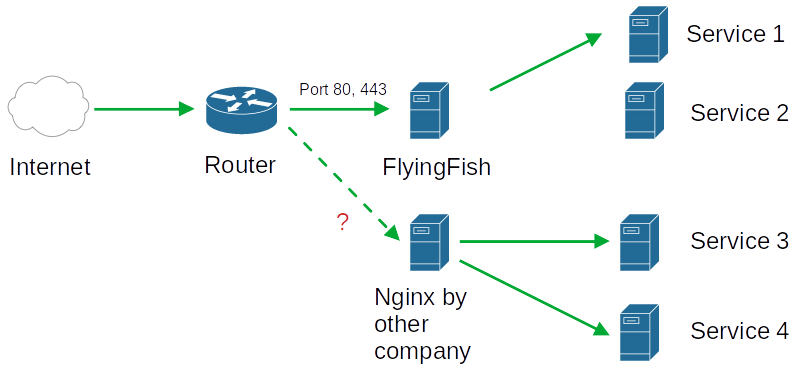

# FlyingFish to other reverse proxy

## Start

As is often the case, another Nginx proxy from another company is on the network. To make matters worse, that's what you're thinking at first, this Nginx manages its own certificates with Lets Encrypt.


In this example it is an nginx, but it can be any reverse proxy.


## Problem

<figure><figcaption></figcaption></figure>

In the graphic you can see that FlyingFish gets port 80 and 443. So the new reverse proxy cannot get these ports from the router. The new reverse proxy also only takes care of a few domains for certificate generation, while FlyingFish manages the other domains.

In summary, we have two reverse proxies (FlyingFish, Nginx from the other company) and each takes care of their domains with certificates.

**The other company now absolutely needs their reverse proxy, as they also provide support and services for the software behind this reverse proxy.**

## Solution

But this is not a problem now. We can put the other reverse proxy behind the FlyingFish. The other reverse proxy can get sovereignty over its domains (itself takes care of creating the certificates at lets encrypt).

<figure><figcaption></figcaption></figure>

## Proceed

