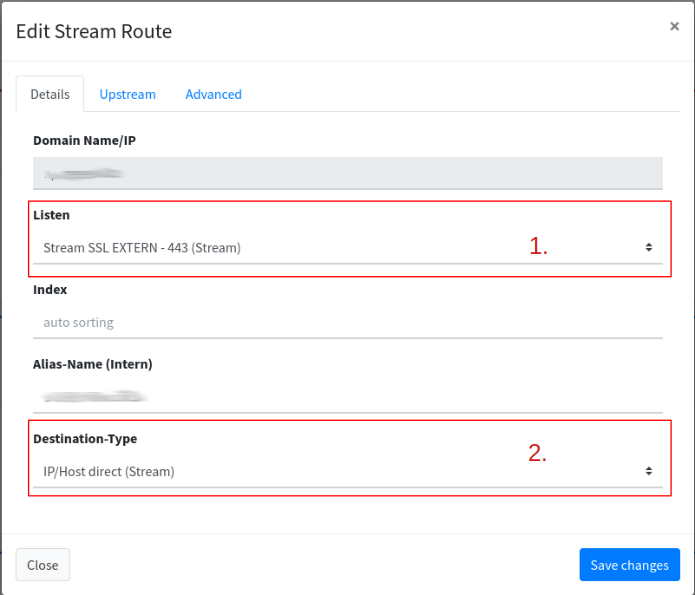

# FlyingFish to other reverse proxy

## Start

As is often the case, another Nginx proxy from another company is on the network. To make matters worse, that's what you're thinking at first, this Nginx manages its own certificates with Lets Encrypt.


In this example it is an nginx, but it can be any reverse proxy.


## Problem

<figure><figcaption></figcaption></figure>

In the graphic you can see that FlyingFish gets port 80 and 443. So the new reverse proxy cannot get these ports from the router. The new reverse proxy also only takes care of a few domains for certificate generation, while FlyingFish manages the other domains.

In summary, we have two reverse proxies (FlyingFish, Nginx from the other company) and each takes care of their domains with certificates.

**The other company now absolutely needs their reverse proxy, as they also provide support and services for the software behind this reverse proxy.**

## Solution

But this is not a problem now. We can put the other reverse proxy behind the FlyingFish. The other reverse proxy can get sovereignty over its domains (itself takes care of creating the certificates at lets encrypt).

<figure><figcaption></figcaption></figure>

## Proceed

Preparatory work: The domain (which points to the Nginx service of the software company) has been set up (records with the provider) and now points to the IP of the router.

If the domain is managed in FlyingFish, the records should still be set after the “[Own DNS Server](../configurations/domains/own-dns-server.md)”.

Now let's [add the route](../configurations/routes.md#add-stream-route).

<figure><figcaption></figcaption></figure>

We now need 2 routes:

1. A <mark style="background-color:orange;">stream</mark> from the listen to the reverse proxy, from and to port 443 (HTTPS). <mark style="color:red;">You can see that the proxy protocol header is removed again at the destination.</mark>
2. From internal HTTP to reverse proxy HTTP. Now you're probably wondering why? The HTTP is used for Let's Encrypt. This stores a file in ".wellknown" to confirm domain control. We pass this task on to the reverse proxy.

### 1. HTTPS Stream Route

<figure><figcaption></figcaption></figure>

1. We take the listen from the stream for port 443 and pass it on completely for the domain (which the company needs for the software) (all protocols that are received on port 443).
2. The target is a host (stream).

<figure><figcaption></figcaption></figure>

1. IP of the reverse proxy.
2. Port of the reverse proxy for HTTPS.
3. Proxy protocol header is removed again. Of course, this has the disadvantage that the IP client information is lost. <mark style="color:red;">But if the reverse proxy doesn't expect the header, unfortunately the header has to be removed!</mark>

### 2. HTTP Route

**Now we've done it!**

<figure><figcaption></figcaption></figure>
