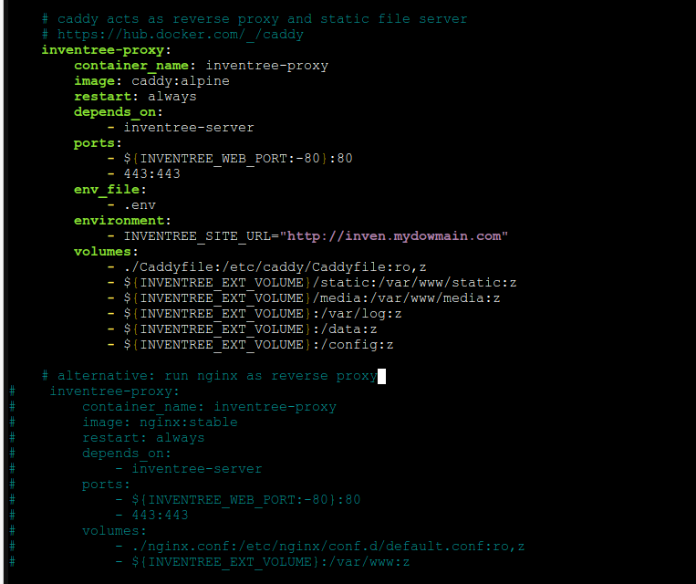

# Inventree - Route

## Step 1 - Installation

When installing Inventree, install docker compose according to the instructions.



Contrary to the documentation, you set the variable "INVENTREE\_SITE\_URL" in the .env to your domain with https. Example: `https://inven.mydomain.com`

In the docker-compose.yml we change the “expose” to “ports” on the service “inventree-server” so that port 8000 can be reached.

<figure><figcaption></figcaption></figure>

We pass an extra enviroment INVENTREE\_SITE\_URL to the caddy server and let it continue to run under “http”.

<figure><figcaption></figcaption></figure>

## Step 2 - FlyingFish Route&#x20;

First we create a route on the list for HTTPs.

<figure><figcaption></figcaption></figure>

Enable SSL (Lets Encrypt).

<figure><figcaption></figcaption></figure>

Set the target to the IP of the inventory over http (for intern).

<figure><figcaption></figcaption></figure>

Set the advanced settings.

<figure><figcaption></figcaption></figure>

We now save everything and as a result we should see a secure login with a valid certificate in a few minutes.

<figure><figcaption></figcaption></figure>
