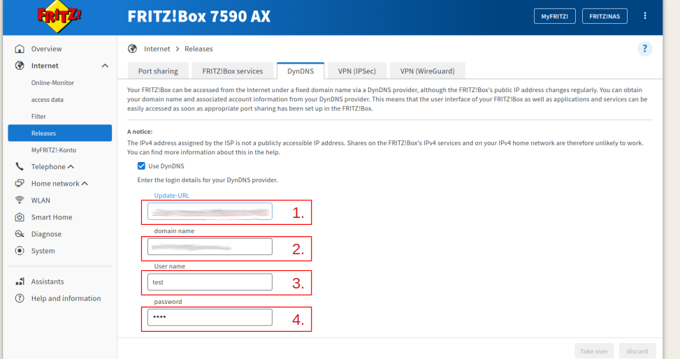

# Own DynDNS Server

TODO

## Settings for the router/DynDNS client

<figure><figcaption>
Settings for a Fritzbox
</figcaption></figure>

<table><thead><tr><th width="97"></th><th>Description</th><th>Example Value</th></tr></thead><tbody><tr><td><mark style="color:red;">1</mark></td><td>URL to the DynDN server</td><td>https://mydyndn-server.org/nic/update</td></tr><tr><td><mark style="color:red;">2</mark></td><td>Domain</td><td>my-domain.org</td></tr><tr><td><mark style="color:red;">3</mark></td><td>Username</td><td>MyUser</td></tr><tr><td><mark style="color:red;">4</mark></td><td>Password</td><td>YourPAssword</td></tr></tbody></table>

