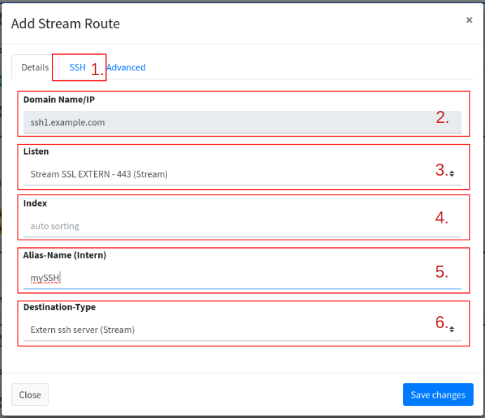
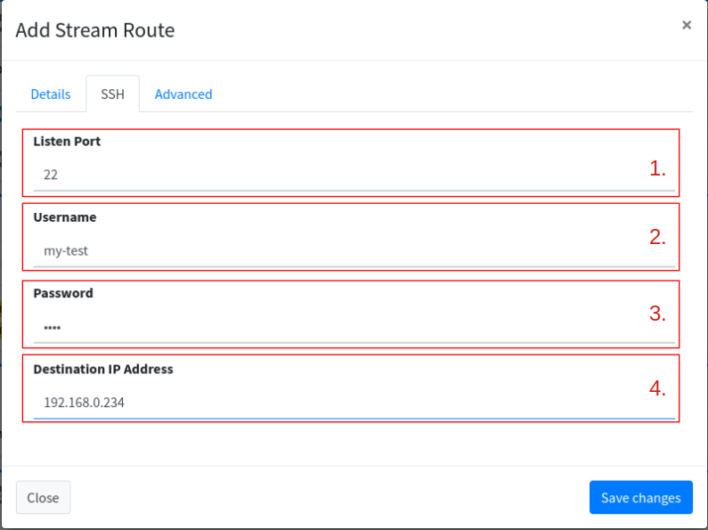

# SSH hidden on HTTPS

## Start

We have several Servers in the network and a router. 2 Server have an SSH server installed. Now it's obvious to open port 22 on the router for one of the servers. A port like 20022 is also usually chosen for the second server. You quickly notice that strangers are trying to access the SSH server using Brut force.

SSH is already a secure story. With IP auto ban and certificates for the ssh client you are on the safe side.

<figure><figcaption>
Share SSH server directly.
</figcaption></figure>

## Problem

But a further step would be that strangers wouldn't know where the SSH ports are.

If we don't know the door, we can't break down a door!

## Solution

Now let's get to the magic. We have an opportunity! We have nginx, and it can split domains from the SSL protocol! SSH uses SSL as the transmission protocol.

Now let’s dig further into our bag of tricks! We need SSH port forwarding. The FlyingFish has an SSH Jump Server integrated. This cannot command any commands, only forward the ports.

So we have the HTTPS port with 443. If a client comes with a special domain, it will be directed to the SSH jump server. This person then knows the appropriate destination in our network using the access data.

<figure><figcaption>
SSH server hidden behind HTTPS.
</figcaption></figure>

## Proceed

To begin, we [create a subdomain](../configurations/domains/#add-domain) (the easiest way is to have your [own DNS server](../configurations/domains/own-dns-server.md) running). We will call the new subdomain <mark style="background-color:purple;">ssh1.example.com</mark> as above.


We won't go into the setting of the record now, the subdomain should resolve the IP correctly (A Record).


Likewise, we now create a [Route](../configurations/routes.md) ([Stream](../configurations/routes.md#add-stream)) for this domain:

<figure><figcaption></figcaption></figure>

1. This tab is activated if "External ssh server (Stream)" was selected under 6.
2. **Domain Name/IP**: Here we can see again under which domain the route is entered.
3. **Listen**: We select the list for "<mark style="background-color:orange;">Stream SSL EXTERN - 443</mark>", because we want to use the SSL on port 443 for our SSH (hide behind the HTTPS).
4. **Index**: We leave the index on auto.
5. **Alias-Name (Intern)**: Any name, I chose "mySSH".
6. **Destination-Type**: We want the target to be an “External ssh server (Stream)” which activates the “SSH” tab for us.

<figure><figcaption></figcaption></figure>

<figure><figcaption>
Meme from imgflip.com
</figcaption></figure>
